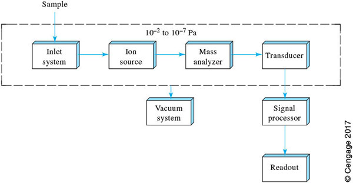
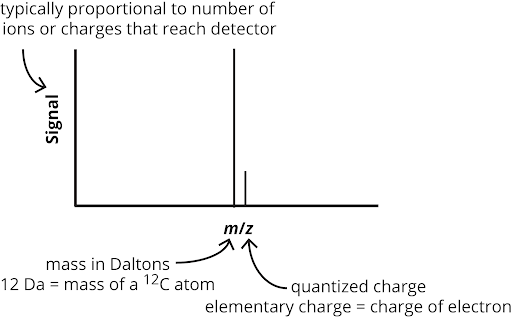

- [Mass Spectrometry](#mass-spectrometry)
  - [Part 1 — What Mass Spectrometry Measures and How Ions Are Made](#part-1--what-mass-spectrometry-measures-and-how-ions-are-made)
    - [1.1 Instrument Architecture](#11-instrument-architecture)
    - [1.2 Mass and Isotopes](#12-mass-and-isotopes)
      - [1.2.1 Three Definitions of Mass](#121-three-definitions-of-mass)
      - [1.2.2 Isotope Distributions](#122-isotope-distributions)
      - [1.2.3 The Relationship Between *m*/*z* and Neutral Mass](#123-the-relationship-between-mz-and-neutral-mass)
    - [1.3 Ionization Sources](#13-ionization-sources)
      - [1.3.1 Electron Ionization (EI)](#131-electron-ionization-ei)
      - [1.3.2 Matrix-Assisted Laser Desorption/Ionization (MALDI)](#132-matrix-assisted-laser-desorptionionization-maldi)
      - [1.3.3 Electrospray Ionization (ESI)](#133-electrospray-ionization-esi)
      - [1.3.4 Comparison of Ionization Methods](#134-comparison-of-ionization-methods)
  - [Part 2 — How Mass Spectrometers Work and What Experiments They Enable](#part-2--how-mass-spectrometers-work-and-what-experiments-they-enable)
    - [2.1 Mass Analyzers and Detectors](#21-mass-analyzers-and-detectors)
      - [2.1.1 Quadrupole Mass Filter](#211-quadrupole-mass-filter)
      - [2.1.2 Time-of-Flight Mass Analyzer](#212-time-of-flight-mass-analyzer)
      - [2.1.3 Detectors](#213-detectors)
    - [2.2 Figures of Merit](#22-figures-of-merit)
      - [2.2.1 Resolving Power](#221-resolving-power)
      - [2.2.2 Mass Accuracy](#222-mass-accuracy)
      - [2.2.3 Comparison of Mass Analyzers](#223-comparison-of-mass-analyzers)
    - [2.3 Acquisition Modes and Tandem MS](#23-acquisition-modes-and-tandem-ms)
      - [2.3.1 Full Scan and Selected Ion Monitoring](#231-full-scan-and-selected-ion-monitoring)
      - [2.3.2 The Triple Quadrupole and Tandem MS](#232-the-triple-quadrupole-and-tandem-ms)
      - [2.3.3 Multiple Reaction Monitoring](#233-multiple-reaction-monitoring)
      - [2.3.4 Tandem-in-Space Versus Tandem-in-Time](#234-tandem-in-space-versus-tandem-in-time)
  - [Acknowledgements](#acknowledgements)

# Mass Spectrometry

Mass spectrometry (MS) is one of the most powerful analytical techniques available to the modern chemist. It can identify unknown compounds, determine molecular masses with extraordinary precision, characterize synthetic polymers, and quantify trace contaminants in environmental and industrial matrices. This chapter establishes the conceptual and quantitative foundation you will need to read the primary literature and use mass spectrometers intelligently.

The chapter is organized around two themes. Part 1 asks: *what does a mass spectrometer measure, and how are ions made?* Part 2 asks: *how do the instruments work, and what kinds of experiments do they enable?*

---

## Part 1 — What Mass Spectrometry Measures and How Ions Are Made

### 1.1 Instrument Architecture

> **Learning objectives**
>
> **1.** Draw a block diagram of a mass spectrometer, label the ion source, mass analyzer, and detector, and describe the function of each component.
>
> **2.** Interpret the axes of a mass spectrum and explain what the *m/z* ratio represents physically.

A mass spectrometer has three essential components: an **ion source**, a **mass analyzer**, and a **detector**. Figure 1 shows a generic block diagram.



**Figure 1a.** Block diagram of a simple mass spectrometer, which includes the ion source (generates gas-phase ions from the sample), the mass analyzer (filters or disperses ions on the basis of their *m*/*z* value), and the tranducer (usually referred to as the detector, which yields a signal based on the number or total charge of ions). Reproduced from Skoog, Figure 20-12. All mass spectrometers include these functional units; many instruments add additional stages of mass analysis or ion manipulation between them. 

The **ion source** converts the analyte from its native state — a solution, a solid, or a gas — into gas-phase ions. This step is essential because the mass analyzer operates under high vacuum and manipulates ions using electric and magnetic fields.

The **mass analyzer** separates or filters ions on the basis of their mass-to-charge ratio, *m*/*z*. 

The **detector** generates a measurable signal proportional to the number or total charge of ions arriving at a given time.

The output of a mass spectrometer is a **mass spectrum**: a plot of detector signal intensity as a function of *m/z*. The *x*-axis reports the mass-to-charge ratio of detected ions; the *y*-axis reports signal intensity, typically normalized to the most intense peak, which is called the **base peak** and is set to 100%.

The *m*/*z* ratio is the ion mass in unified atomic mass units (Da) divided by its charge number *z*, where *z* is a dimensionless integer equal to the number of elementary charges carried by the ion. For a singly charged ion ($z = 1$), *m/z* numerically equals the mass of the ion. For a doubly charged ion ($z = 2$), *m*/*z* is half the mass of the ion.



**Figure 1b.** The axes of a mass spectrum, explained.

---

### 1.2 Mass and Isotopes

#### 1.2.1 Three Definitions of Mass

> **Learning objective**
>
> **3.** Define nominal mass, monoisotopic mass, and average mass, and calculate each for a molecule or ion of given elemental composition.

Because atoms exist as mixtures of isotopes, "the mass" of a molecule is not a single number. Three definitions are commonly encountered in mass spectrometry.

**Nominal mass** is an integer computed by summing the number of protons and neutrons using the *lightest stable isotope* of each element, treated as pure integers.

**Monoisotopic mass** is the exact mass computed using the precise atomic mass of the lightest stable isotope of each element (Table 1). By definition, the monoisotopic mass of $^{12}$C is exactly 12 Da.

**Average mass** is the abundance-weighted average over all naturally occurring isotopes of each element, corresponding to the molar mass reported on a periodic table.

**Table 1.** Nominal, monoisotopic, and average masses of elements common in organic molecules.

| Element | Nominal mass (Da) | Monoisotopic mass (Da) | Average mass (Da) |
|:--------|------------------:|-----------------------:|------------------:|
| H       | 1                 | 1.0078250              | 1.00794           |
| C       | 12                | 12.0000000             | 12.0107           |
| N       | 14                | 14.0030740             | 14.0067           |
| O       | 16                | 15.9949146             | 15.9994           |
| S       | 32                | 31.9720707             | 32.065            |

> **Worked Example 1 — Nominal and monoisotopic mass.** Calculate the nominal mass and monoisotopic mass of the $[\text{M+H}]^+$ ion of sinapinic acid ($\text{C}_{11}\text{H}_{12}\text{O}_5$).
>
> Forming the $[\text{M+H}]^+$ ion adds one proton to the neutral molecule, giving the ion formula $\text{C}_{11}\text{H}_{13}\text{O}_5^+$.
>
> **Nominal mass:**
> $$m_{\text{nominal}} = 12(11) + 1(13) + 16(5) = 132 + 13 + 80 = 225 \text{ Da}$$
>
> **Monoisotopic mass:**
> $$m_{\text{mono}} = 12.000(11) + 1.00783(13) + 15.99491(5) = 132.000 + 13.102 + 79.975 = 225.077 \text{ Da}$$
>
> The monoisotopic mass is slightly *larger* than the nominal mass. This **mass defect** arises because nuclear binding energy reduces the effective mass of protons and neutrons below their free-particle values by slightly different amounts for different elements. For hydrogen-rich organic molecules, the net effect is a positive mass defect relative to the nominal mass.

#### 1.2.2 Isotope Distributions

> **Learning objective**
>
> **4.** Predict how the isotope distribution of a mass spectrum changes with molecular size, and explain why the monoisotopic peak is not the most intense peak for large molecules such as synthetic polymers.

Every molecule produces not just a single peak but an **isotope distribution** — a cluster of peaks separated by approximately 1 Da (for singly charged ions) corresponding to ions that contain one or more heavy isotopes. The naturally occurring heavy isotopes most relevant to organic and biological molecules are $^{13}$C (1.1% relative to $^{12}$C), $^{2}$H (0.015%), $^{15}$N (0.37%), $^{18}$O (0.20%), and $^{34}$S (4.25%).

For small molecules such as caffeine ($\text{C}_8\text{H}_{10}\text{N}_4\text{O}_2$), the monoisotopic peak is the most intense peak in the distribution, because the probability of any single molecule containing a heavy isotope is low (Figure 2).


**Figure 2.** Simulated isotope distribution of caffeine ($\text{C}_8\text{H}_{10}\text{N}_4\text{O}_2$). The monoisotopic peak, which corresponds ions in which all carbon atoms are $^{12}\text{C}$, all hydrogen atoms are $^{1}\text{H}$, all nitrogen atoms are $^{14}\text{N}$, and all oxygen atoms are $^{16}\text{O}$, is the most intense. The nominal, monoisotopic, and average masses are labeled. (Image by Kermit Murray, [Wikimedia Commons](https://commons.wikimedia.org/wiki/File:Caffeine_mass.gif), public domain.)

For large molecules, the situation is strikingly different. Consider a polystyrene oligomer with degree of polymerization $n = 40$, giving an approximate formula $\text{C}_{320}\text{H}_{322}$ and molecular mass $\sim$4,200 Da. With 320 carbon atoms each carrying a 1.1% probability of being $^{13}$C, the probability that *all* carbons are $^{12}$C is $(0.989)^{320} \approx 0.03$ — less than 3%. The most intense peak therefore shifts to higher mass and the monoisotopic peak may be barely detectable. Figure 3 illustrates this behavior using the peptide hormone glucagon as a representative large molecule; the same broadening and shift of the isotope envelope is observed for high-molecular-weight synthetic polymers.


**Figure 3.** Simulated isotope distribution of glucagon ($\text{C}_{153}\text{H}_{224}\text{N}_{42}\text{O}_{50}$, MW $\approx$ 3,483 Da) as a representative large molecule. The monoisotopic peak is no longer the most intense; the envelope is centered near the average mass. The same pattern is observed for any large molecule, including synthetic polymers. (Image by Kermit Murray, [Wikimedia Commons](https://commons.wikimedia.org/wiki/File:Glucagon_mass.gif), public domain.)

This has a direct practical consequence. For large molecules — synthetic polymers, for example — measured at low resolving power, where the instrument cannot resolve individual isotope peaks, the measured peak center corresponds approximately to the **average mass**. For small molecules, or large molecules measured at high resolving power where individual peaks are resolved, the **monoisotopic mass** is reported.

#### 1.2.3 The Relationship Between *m*/*z* and Neutral Mass

> **Learning objectives**
>
> **5.** Distinguish between the *m*/*z* value measured by the instrument and the neutral mass of the analyte, and perform the conversion between the two.
>
> **8.** Calculate the neutral mass of an analyte from the *m*/*z* values of a multiply charged ESI ion series or from the *m*/*z* of a singly charged MALDI or EI ion.

The mass analyzer measures *m*/*z*, not the neutral mass of the analyte. To recover the neutral mass $M$, you must account for the charges added or removed during ionization. For a positive ion formed by adding $z$ protons:

$$\frac{m}{z} = \frac{M + z \cdot m_{\text{H}}}{z}$$

where $m_{\text{H}} = 1.007276$ Da is the mass of a proton. Rearranging:

$$\boxed{M = z\left(\frac{m}{z}\right) - z \cdot m_{\text{H}}}$$

For a singly charged ion ($z = 1$), this simplifies to $M = (m/z) - m_{\text{H}}$.

For multiply charged ESI ions, the charge state $z$ must first be determined from the spacing between peaks in the charge-state envelope.

> **Worked Example 2 — Neutral mass from ESI charge states.** An ESI mass spectrum of a poly(ethylene glycol) (PEG) oligomer shows two prominent peaks at $m/z = 1000.6$ and $m/z = 1251.0$. Determine the charge states and the neutral mass of the oligomer.
>
> Both peaks arise from the same neutral molecule $M$. Let the peak at lower *m/z* correspond to charge state $z_1$ and the peak at higher *m/z* to charge state $z_2 = z_1 - 1$ (one fewer proton). Setting both expressions for $M$ equal:
>
> $$z_1\left(\frac{m}{z}\right)_1 - z_1 m_{\text{H}} = z_2\left(\frac{m}{z}\right)_2 - z_2 m_{\text{H}}$$
>
> Solving for $z_1$:
>
> $$z_1 = \frac{\left(\frac{m}{z}\right)_2 - m_{\text{H}}}{\left(\frac{m}{z}\right)_2 - \left(\frac{m}{z}\right)_1} = \frac{1251.0 - 1.007}{1251.0 - 1000.6} = \frac{1249.99}{250.4} \approx 5$$
>
> The peak at $m/z = 1000.6$ carries $z = 5$ charges; the peak at $m/z = 1251.0$ carries $z = 4$. The neutral mass is:
>
> $$M = 5(1000.6) - 5(1.007) = 5003.0 - 5.0 \approx 4998 \text{ Da}$$
>
> Verify with the second peak: $M = 4(1251.0) - 4(1.007) = 5004.0 - 4.0 \approx 5000 \text{ Da}$. The small discrepancy reflects rounding; both values are consistent with a PEG-5000 oligomer ($\approx$113 ethylene oxide repeat units).

---

### 1.3 Ionization Sources

> **Learning objectives**
>
> **6.** Describe the mechanism of ion formation in electron ionization (EI), matrix-assisted laser desorption/ionization (MALDI), and electrospray ionization (ESI), and classify each as a hard or soft ionization technique.
>
> **7.** Compare EI, MALDI, and ESI with respect to the types of ions produced and the analyte classes for which each is most appropriate.

The ion source is the most chemically consequential part of the instrument. The choice of ionization method determines which analytes can be analyzed, what ionic species are produced, and how much structural information is available from the spectrum.

#### 1.3.1 Electron Ionization (EI)

In electron ionization, analyte vapor is bombarded by high-energy electrons (conventionally 70 eV) emitted from a heated metal filament. The collision ejects an electron from the analyte molecule, producing a **radical cation** (the molecular ion, $\text{M}^{+\bullet}$):

$$\text{M} + e^-_{70\,\text{eV}} \rightarrow \text{M}^{+\bullet} + 2e^-$$

At 70 eV, the molecular ion retains substantial internal energy — far more than is needed to break a typical chemical bond (3–5 eV). As a result, the molecular ion rapidly **fragments** into smaller ions and neutral species. EI is classified as a **hard ionization** technique.

Fragmentation is analytically valuable: the pattern of fragment ions is characteristic of the molecular structure and can be used for compound identification by library matching (the NIST Mass Spectral Library contains over 350,000 reference EI spectra). However, for labile molecules, fragmentation can be so extensive that the molecular ion is not observed.

EI requires a volatile and thermally stable analyte, making it an excellent match for gas chromatography (GC). GC-MS with EI detection is the workhorse technique for environmental monitoring, forensic chemistry, and flavor and fragrance analysis.

#### 1.3.2 Matrix-Assisted Laser Desorption/Ionization (MALDI)

MALDI was developed in the late 1980s and rapidly became the method of choice for characterizing synthetic polymers and large biomolecules that cannot survive vaporization. In MALDI, the analyte is co-crystallized with a large molar excess of a **matrix** compound on a metal target plate. The matrix is a small organic molecule that (i) absorbs strongly at the wavelength of a UV laser and (ii) contains an acidic functional group — typically a carboxylic acid, but in some cases a phenol or enol — that facilitates proton transfer to the analyte in the gas phase.

Two common MALDI matrices are shown in Figure 4.


**Figure 4.** (*top*) α-Cyano-4-hydroxycinnamic acid (CHCA), widely used for small molecules, synthetic polymers, and peptides. (*bottom*) Sinapinic acid, commonly used for large biomolecules. Both contain an extended conjugated system for UV absorption and a carboxylic acid for gas-phase proton transfer. Other matrices — such as dithranol (1,8,9-anthracenetriol) for hydrophobic polymers like polystyrene, and 2,5-dihydroxybenzoic acid (2,5-DHB) for polyesters and polyethers — extend MALDI to a wide range of polymer classes. ([Wikimedia Commons](https://commons.wikimedia.org/wiki/File:Alpha-cyano-4-hydroxycinnamic_acid.svg) / [Wikimedia Commons](https://commons.wikimedia.org/wiki/File:Sinapic_acid.png), public domain.)

When the laser fires, the matrix absorbs the photon energy and induces rapid co-desorption of the matrix–analyte crystal into the gas phase. Proton transfer from the matrix to the analyte in the resulting plume produces predominantly **singly charged** $[\text{M+H}]^+$ ions in positive mode, or $[\text{M-H}]^-$ in negative mode. Because the analyte never requires vaporization, MALDI can be applied to thermally labile molecules with masses exceeding 100 kDa.

MALDI is a **soft ionization** technique: very little excess energy is deposited in the analyte, fragmentation is minimal, and the spectrum is typically simple — often just one or a few peaks per analyte. For synthetic polymers, MALDI produces a characteristic distribution of oligomer peaks separated by the mass of the repeat unit, enabling direct determination of number-average and weight-average molecular weights, dispersity, and end-group composition. MALDI targets accommodate hundreds of sample spots (Figure 5), supporting high-throughput workflows.


**Figure 5.** A MALDI target with 384 sample positions matching the footprint of a standard microplate. (Image by Kermit Murray, [Wikimedia Commons](https://commons.wikimedia.org/wiki/File:MALDI_384_spot_target.jpg), CC BY-SA 3.0.)

#### 1.3.3 Electrospray Ionization (ESI)

ESI, developed by John Fenn in the 1980s (2002 Nobel Prize in Chemistry), transfers ions directly from solution into the gas phase at atmospheric pressure. The analyte solution is pumped through a metal capillary held at high potential (1–5 kV) relative to the mass spectrometer inlet. The electric field causes charge accumulation at the capillary tip, deforming the liquid meniscus into a **Taylor cone** from which a fine spray of highly charged droplets is emitted (Figure 6).


**Figure 6.** Electrospray ionization in positive ion mode. The Taylor cone forms at the capillary tip. Charged droplets undergo repeated cycles of solvent evaporation and Coulombic fission until individual gas-phase ions are released. ([Wikimedia Commons](https://commons.wikimedia.org/wiki/File:ESI_positive_mode_(21589986840).jpg), CC BY 2.0.)

As droplets travel toward the inlet, solvent evaporation increases the charge density until Coulombic repulsion overcomes surface tension, causing **Coulombic fission** into smaller droplets. This process repeats until individual gas-phase ions are released.

ESI produces even-electron ions: $[\text{M+n H}]^{n+}$ in positive mode or $[\text{M-nH}]^{n-}$ in negative mode. A key feature is the formation of **multiply charged ions**: synthetic polymers, industrial surfactants, and other large analytes can acquire many protons simultaneously, producing a charge-state envelope of peaks at different *m/z* values (as computed in Worked Example 2). This brings high-mass analytes within the *m/z* range of common mass analyzers.

ESI is a **soft ionization** technique and is the dominant method in liquid chromatography–mass spectrometry (LC-MS) because it operates from solution at atmospheric pressure, making it directly compatible with LC eluents. It is widely used in environmental analysis (pharmaceutical residues, pesticides, and industrial chemicals in water and soil), quality control of industrial chemicals and polymer additives, and metabolite profiling in food and beverage science.

#### 1.3.4 Comparison of Ionization Methods

**Table 2.** Comparison of EI, MALDI, and ESI.

| Property | EI | MALDI | ESI |
|:---------|:--:|:-----:|:---:|
| Classification | Hard | Soft | Soft |
| Primary ion type | $\text{M}^{+\bullet}$, fragment ions | $[\text{M+H}]^+$ | $[\text{M+nH}]^{n+}$ |
| Charge states produced | Singly charged | Singly charged | Multiple |
| Analyte state required | Vapor | Solid co-crystal | Solution |
| Typical mass range | <1 kDa | Up to 500 kDa | Up to MDa |
| Common applications | GC-MS, volatile organics | Synthetic polymers, surfactants, pharmaceuticals, lipids | LC-MS, environmental contaminants, industrial chemicals, polymers |
| Structural (fragment) information | Rich, without MS/MS | Minimal | Minimal without MS/MS |

---

## Part 2 — How Mass Spectrometers Work and What Experiments They Enable

### 2.1 Mass Analyzers and Detectors

> **Learning objectives**
>
> **9.** Explain the operating principle of a quadrupole mass filter, including the roles of the RF and DC voltages in establishing a stability window that transmits a narrow range of *m*/*z* values.
>
> **10.** Explain the operating principle of a time-of-flight mass analyzer, including how differences in ion velocity after acceleration by a fixed potential result in the temporal separation of ions with different *m*/*z* values.
>
> **11.** Describe the operating principle of the Faraday cup, the discrete dynode electron multiplier, and the multichannel plate (MCP) detector, and explain why MCP detectors are preferred for time-of-flight instruments.

#### 2.1.1 Quadrupole Mass Filter

A quadrupole mass filter consists of four parallel cylindrical rods arranged symmetrically around a central axis (Figure 7). Opposing rod pairs are connected electrically: one pair receives a voltage $+(U + V\cos\omega t)$ and the other receives $-(U + V\cos\omega t)$, where $U$ is a DC offset and $V\cos\omega t$ is a radiofrequency (RF) oscillation at angular frequency $\omega$ (typically in the MHz range).


**Figure 7.** Schematic of a quadrupole mass filter. Ions enter along the central axis. The combined DC and RF voltages create a dynamic field that transmits only a narrow *m/z* window; all other ions follow unstable trajectories, strike the rods, and are neutralized. ([Wikimedia Commons](https://commons.wikimedia.org/wiki/File:Analizzatore_di_massa_a_quadrupolo.svg), CC BY-SA 3.0.)

The combined DC and RF voltages create a **quadrupolar field** whose potential resembles a saddle surface that rotates in time. In one transverse plane, the DC voltage focuses ions toward the axis while the RF destabilizes light ions below a threshold *m/z* — their small inertia causes them to follow the rapid oscillation and be ejected (acting as a high-pass filter). In the orthogonal plane, the DC voltage defocuses ions away from the axis; the RF can stabilize light ions against this deflection, but heavy ions are pulled out (acting as a low-pass filter). Only ions within a narrow *m/z* range satisfy the stability conditions in *both* planes simultaneously and transit the device; all others are lost to the rods.

By ramping the DC and RF voltages together at a fixed ratio, the quadrupole scans through successive *m/z* values to build up a mass spectrum point by point. This makes it a **scanning analyzer**. Quadrupole mass filters are widely deployed in GC-MS and targeted LC-MS applications because of their robustness, moderate cost, and fast scan speeds.

#### 2.1.2 Time-of-Flight Mass Analyzer

A time-of-flight (TOF) analyzer separates ions by the time they take to traverse a field-free drift region after being accelerated to the same kinetic energy per charge. When an ion of mass $m$ and charge number $z$ is accelerated through potential $\Delta V$:

$$z \cdot e \cdot \Delta V = \frac{1}{2} m v^2$$

All ions receive the same kinetic energy per unit charge. The velocity of each ion is therefore:

$$v = \sqrt{\frac{2 z e \Delta V}{m}}$$

The time $t$ required to traverse a field-free drift region of length $L$ is:

$$t = \frac{L}{v} = L\sqrt{\frac{m}{2 z e \Delta V}} \;\propto\; \sqrt{\frac{m}{z}}$$

Lighter ions travel faster and arrive at the detector first; heavier ions arrive later. Because all ions are accelerated and detected in every acquisition cycle, the TOF is a **multichannel analyzer** that records the complete mass spectrum with each flight event. Modern TOF instruments incorporate a **reflectron** (an electrostatic ion mirror) that compensates for small kinetic energy differences among ions of the same *m/z*, substantially improving resolving power.

#### 2.1.3 Detectors

**Faraday cup.** The simplest MS detector is a metal cup that collects ions directly. Arriving ions deposit their charge, generating a small electric current measured with an ammeter ($1\ \text{A} = 1\ \text{C\,s}^{-1}$, and $1\ \text{C} \approx 6.24 \times 10^{18}$ elementary charges). The Faraday cup is robust and inherently quantitative, but provides no signal amplification, limiting its use to relatively high ion currents.

**Discrete dynode electron multiplier.** Most mass spectrometers use an electron multiplier for signal amplification (Figure 8). When an ion strikes the first surface (a conversion dynode), it ejects one or more **secondary electrons**. Those electrons are accelerated toward the next dynode, where each ejects additional secondary electrons. After $n$ stages each with secondary-electron yield $\delta$, the overall gain is:

$$G = \delta^n$$

For 15 dynode stages with $\delta = 2$, the gain is $G = 2^{15} = 32{,}768$. Typical yields of 2–3 give overall gains of $10^4$–$10^6$, enabling single-ion detection.


**Figure 8.** Discrete dynode (*left*) and continuous dynode (*right*) electron multipliers. A voltage divider network maintains a potential difference between successive dynodes, accelerating secondary electrons from stage to stage. Both types are common detectors on quadrupole and ion trap instruments. ([Wikimedia Commons](https://commons.wikimedia.org/wiki/File:Discrete_and_Continuous_Dynode_Systems.jpg), CC BY-SA 3.0.)

**Multichannel plate (MCP) detector.** An MCP is a thin glass disk perforated by millions of microscopic channels (typically 10–25 μm diameter), each acting as an independent continuous-dynode electron multiplier. MCPs are the preferred detector for TOF instruments for two reasons. First, their large active area (several cm²) efficiently intercepts the spatially distributed ion beam produced by orthogonal-acceleration TOF sources. Second, their short electron transit paths give response times on the order of nanoseconds, which is required for the high temporal resolution needed in high-resolving-power TOF measurement. MCPs are typically deployed in a "chevron" pair configuration to suppress ion feedback.

---

### 2.2 Figures of Merit

> **Learning objectives**
>
> **12.** Define resolving power and calculate it from a mass spectrum using the FWHM of a peak, and explain how the required resolving power depends on the analyte and the analytical question.
>
> **13.** Define mass accuracy in ppm, calculate it from measured and expected *m/z* values, and explain why high mass accuracy is required to distinguish isobaric species with similar elemental compositions (e.g., structural isomers of pesticides or industrial chemicals, or compounds differing by one element substitution).
>
> **14.** Compare the quadrupole mass filter, quadrupole ion trap, time-of-flight, and Fourier transform analyzers with respect to resolving power, mass accuracy, and whether they are scanning or multichannel instruments, and explain the analytical consequences of each design for sensitivity and acquisition speed.

#### 2.2.1 Resolving Power

The ability of a mass analyzer to distinguish ions with similar *m/z* values is characterized by its **resolving power**:

$$\boxed{R_p = \frac{m/z}{\Delta(m/z)_{\text{FWHM}}}}$$

where $\Delta(m/z)_{\text{FWHM}}$ is the full width of the peak at half its maximum height (FWHM). A higher $R_p$ means the instrument can distinguish more closely spaced peaks. Note that $R_p$ characterizes a single peak; it is distinct from the peak-to-peak resolution used in chromatography, which describes the separation between two adjacent peaks.

> **Worked Example 3 — Resolving power.** A quadrupole spectrum shows a peak at $m/z = 500.0$ with a FWHM of 0.70 Da. A TOF spectrum of the same ion shows a FWHM of 0.050 Da. Calculate the resolving power in each case.
>
> **Quadrupole:**
> $$R_p = \frac{500.0}{0.70} \approx 710$$
>
> **TOF:**
> $$R_p = \frac{500.0}{0.050} = 10{,}000$$
>
> This 14-fold difference has major analytical consequences: the quadrupole provides unit-mass resolution adequate for most small-molecule identification by nominal mass, while the TOF resolves peaks differing by 50 mDa — sufficient to determine molecular formulas by exact mass.

The required resolving power depends on the analytical problem. For GC-MS of small volatile compounds that differ by many daltons, $R_p \sim 10^2$–$10^3$ is adequate. In many applications of mass spectrometry, including environmental, and industrial sample analysis, candidate ions may differ by only a few tens of millidaltons, $R_p \geq 10^4$ is needed. For large synthetic polymers measured at low resolving power, individual isotope peaks are unresolved and the measured peak center corresponds to the average mass.

#### 2.2.2 Mass Accuracy

Resolving power describes the *width* of a peak; **mass accuracy** describes how close the measured *m/z* is to the theoretically expected value. It is expressed in parts per million (ppm):

$$\boxed{\text{mass accuracy (ppm)} = \left\lvert \frac{(m/z)_{\text{measured}} - (m/z)_{\text{expected}}}{(m/z)_{\text{expected}}} \right\rvert \times 10^6}$$

> **Worked Example 4 — Mass accuracy.** A TOF instrument measures the $[\text{M+H}]^+$ ion of atrazine (a widely used herbicide, $\text{C}_8\text{H}_{14}\text{ClN}_5$) at *m*/*z* = 216.1023$. The expected monoisotopic *m*/*z* is 216.1011. Calculate the mass accuracy in ppm.
>
> $$\text{mass accuracy} = \left\lvert \frac{216.1023 - 216.1011}{216.1011} \right\rvert \times 10^6 = \frac{0.0012}{216.1011} \times 10^6 \approx 5.6 \text{ ppm}$$
>
> This is a typical result for a well-calibrated TOF instrument and is sufficient to confirm the molecular formula of the analyte and distinguish it from interferents with the same nominal mass.

High mass accuracy is essential for distinguishing analytes with the same nominal mass but different elemental compositions. The dipeptides in Table 3 provide a clear illustration: NE, EN, and DQ are **isobaric** — they share identical elemental compositions and cannot be distinguished by any instrument. DK has the same nominal mass as DQ but differs in elemental composition ($\text{CH}_4$ vs. $\text{O}$, a mass difference of 36 mDa). A quadrupole with roughly 1000 ppm accuracy cannot distinguish DQ from DK; a TOF or Fourier transform instrument with better than 10 ppm accuracy can. Although these are biological molecules, the same logic applies directly to isobaric small molecules encountered in environmental and industrial analysis — for example, distinguishing structural isomers of pesticides or polymer additives that happen to share a nominal mass.

The structure of the dipeptide NE (Asn-Glu) is shown in Figure 9 to make the formula in Table 3 concrete; NE and DQ are true isobars that share identical elemental compositions and are therefore indistinguishable by mass alone.


**Figure 9.** Structure of the dipeptide Asn-Glu (NE, $\text{C}_9\text{H}_{15}\text{N}_3\text{O}_6$, neutral MW = 261.10 Da). The $[\text{M+H}]^+$ ion has the formula $\text{C}_9\text{H}_{16}\text{N}_3\text{O}_6^+$ and exact mass 262.1034 Da — identical to EN and DQ, making these three dipeptides true isobars. ([PubChem CID 7019991](https://pubchem.ncbi.nlm.nih.gov/compound/7019991), public domain.)

**Table 3.** Monoisotopic masses of five dipeptides illustrating the need for high mass accuracy. All five have nominal mass 262 Da (except NQ at 261 Da). Formulas are given for the $[\text{M+H}]^+$ ion.

| Peptide | $[\text{M+H}]^+$ formula | Exact mass (Da) | $\Delta m$ from DQ |
|:--------|:--------------------------|----------------:|:------------------:|
| NQ      | $\text{C}_9\text{H}_{17}\text{N}_4\text{O}_5^+$ | 261.1194 | -1.0 Da |
| NE      | $\text{C}_9\text{H}_{16}\text{N}_3\text{O}_6^+$ | 262.1034 | 0 (isobar) |
| EN      | $\text{C}_9\text{H}_{16}\text{N}_3\text{O}_6^+$ | 262.1034 | 0 (isobar) |
| DQ      | $\text{C}_9\text{H}_{16}\text{N}_3\text{O}_6^+$ | 262.1034 | — |
| DK      | $\text{C}_{10}\text{H}_{20}\text{N}_3\text{O}_5^+$ | 262.1398 | +36 mDa |

#### 2.2.3 Comparison of Mass Analyzers

Mass analyzers differ substantially in their figures of merit. Table 4 provides a practical guide to instruments encountered in analytical facilities. Two additional distinctions are worth emphasizing.

A **scanning analyzer** (quadrupole filter, magnetic sector) transmits one *m/z* value at a time and discards all others. A **multichannel analyzer** (TOF, Fourier transform, ion trap) detects all *m/z* values within a single acquisition event. This improves sensitivity for full-scan experiments because no ions are discarded.

**Acquisition speed** is critically important in LC-MS, where chromatographic peaks may be only a few seconds wide. An instrument that cannot acquire a complete mass spectrum within a fraction of a second will under-sample the chromatogram and miss transient analytes.

**Table 4.** Approximate figures of merit for common mass analyzers. Values are representative of typical commercial instruments and may vary with operating conditions.

| Analyzer | Scanning | Multichannel | $R_p$ (approx.) | Accuracy (ppm) |
|:---------|:--------:|:------------:|:---------------:|:--------------:|
| Quadrupole filter             | Yes | No  | $10^2$–$10^3$ | $10^2$–$10^3$ |
| Quadrupole ion trap           | Yes | Yes | $10^3$         | $10^2$         |
| Time-of-flight                | No  | Yes | $10^4$         | 1–10           |
| Magnetic sector               | Yes | No  | $10^4$–$10^5$  | ~1        |
| Fourier transform (FT-ICR / Orbitrap) | No | Yes | $10^5$–$10^6$ | <1 |

The quadrupole filter occupies one extreme of this table: low resolving power and modest mass accuracy, but robust, inexpensive, and fast. Fourier transform instruments occupy the other extreme: extraordinary resolving power and sub-ppm mass accuracy at the cost of greater size, expense, and slower acquisition. TOF instruments offer a practical middle ground and are increasingly common in environmental analysis, polymer characterization, and small-molecule identification.

---

### 2.3 Acquisition Modes and Tandem MS

> **Learning objectives**
>
> **15.** Distinguish between full-scan and selected ion monitoring (SIM) acquisition on a quadrupole mass filter, and explain the tradeoff between spectral information content and sensitivity in each mode.
>
> **16.** Describe the configuration of a triple-quadrupole instrument (Q1–q2–Q3), explain the function of the collision cell, and identify the scan modes it enables.
>
> **17.** Explain why MRM is widely used for targeted quantitation in complex matrices, and describe the role of the precursor and product ion selections in providing specificity.
>
> **18.** Distinguish between tandem-in-space (e.g., triple quadrupole) and tandem-in-time (e.g., quadrupole ion trap) approaches to MS/MS, and identify one advantage of each.

The hardware described above can be operated in different **acquisition modes** optimized for different analytical goals. Understanding these modes is essential for reading the analytical literature.

#### 2.3.1 Full Scan and Selected Ion Monitoring

In **full-scan** mode, the quadrupole ramps its voltages across a wide *m/z* range and records the complete mass spectrum. Full-scan data are information-rich: every ion in the source is detected, and the spectrum can be used for compound identification. The limitation is sensitivity — at any instant, the instrument transmits only one *m/z* and discards all others.

In **selected ion monitoring (SIM)**, the quadrupole is fixed to transmit only one (or a small number of) specific *m/z* values. Because the instrument dwells on target ions instead of scanning past them, the duty cycle for those ions increases dramatically, improving sensitivity by 1–3 orders of magnitude compared to full scan. The tradeoff is a complete loss of spectral information for non-target ions.

SIM is the method of choice when the analyte identity is already established and maximum sensitivity is required — for example, in environmental monitoring for trace pesticides or pharmaceutical residues in water, or in industrial quality control for detecting specific impurities at low concentrations.

#### 2.3.2 The Triple Quadrupole and Tandem MS

The most powerful way to obtain structural information from soft-ionization experiments — while also achieving high sensitivity and high specificity simultaneously — is **tandem mass spectrometry (MS/MS)**. In MS/MS, ions are selected by mass, fragmented, and the resulting fragment ions are analyzed in a second stage.

The **triple quadrupole** (QqQ) is the canonical MS/MS platform. It consists of three sequential devices:

- **Q1:** a mass-filtering quadrupole that selects a specific **precursor ion** by *m/z*.
- **q2:** an RF-only quadrupole (no DC voltage, no mass filtering) that acts as a **collision cell**. The precursor ion is accelerated into a bath of inert collision gas (typically nitrogen or argon at 1–10 mTorr). Energetic collisions fragment it into **product ions** by collision-induced dissociation (CID).
- **Q3:** a second mass-filtering quadrupole that analyzes the product ions.

```
[Ion Source] ──▶ [  Q1  ] ──▶ [   q2   ] ──▶ [  Q3  ] ──▶ [Detector]
                  Precursor    Collision       Product
                  selection    cell (CID)      analysis
```

**Figure 10.** Block diagram of a triple-quadrupole (QqQ) instrument. The RF-only collision cell q2 transmits all ions while the inert gas induces fragmentation by collision-induced dissociation.

The triple quadrupole supports four principal scan modes, summarized in Table 5.

**Table 5.** Scan modes of the triple-quadrupole instrument.

| Scan mode | Q1 | Q3 | Primary use |
|:----------|:--:|:--:|:------------|
| Product ion scan | Fixed (one precursor) | Scanning | Structural characterization; identifying fragments |
| Precursor ion scan | Scanning | Fixed (one product) | Detecting all precursors that yield a specific fragment; class screening |
| Neutral loss scan | Scanning | Scanning (fixed offset) | Detecting all precursors that lose a specific neutral; e.g., sulfonated surfactants losing SO$_3$ (80 Da) |
| Multiple reaction monitoring (MRM) | Fixed | Fixed | Targeted quantitation |

#### 2.3.3 Multiple Reaction Monitoring

MRM is the gold standard for targeted quantitation in complex matrices such as surface water, soil extracts, food samples, or industrial effluents. Its high selectivity arises from requiring that a detected ion satisfy *two* independent mass selection criteria simultaneously: the correct precursor *m/z* in Q1 and the correct product *m/z* in Q3. An interferent must match both the precursor mass and the specific fragmentation chemistry of the target analyte — a far more stringent requirement than either criterion alone. This makes MRM ideal for detecting trace pesticide residues in drinking water, pharmaceutical contaminants in environmental matrices, or polymer additives in industrial samples at concentrations far below what full-scan methods can achieve.

In practice, MRM transitions are developed by infusing a pure analyte standard and identifying the most abundant and most specific product ions. Quantitation is achieved by comparing the MRM signal of the analyte in an unknown sample to that of a stable-isotope-labeled internal standard spiked at known concentration, which compensates for both matrix effects and day-to-day instrument variability.

#### 2.3.4 Tandem-in-Space Versus Tandem-in-Time

The triple quadrupole achieves MS/MS by performing precursor selection, fragmentation, and product ion analysis in three physically *separate* regions of the instrument. This is **tandem-in-space**. The advantage is that all three operations occur simultaneously and continuously, enabling high duty cycles and excellent sensitivity in MRM mode. The limitation is that adding more stages of mass analysis requires additional physical hardware.

An alternative is **tandem-in-time**, used in ion trap instruments (the quadrupole ion trap, the linear ion trap, and the Orbitrap with its associated linear trap). Here, all steps — ion accumulation, precursor isolation, fragmentation, and product ion analysis — occur in a temporal sequence within the *same* physical device. The advantage is flexibility: because no additional hardware is required for each stage, experiments with three or more stages of mass analysis (MS$^n$, $n \geq 3$) are readily implemented. The tradeoff is that each additional isolation step reduces the ion population available for detection, eventually limiting sensitivity for high-order MS$^n$ experiments.

## Acknowledgements
This documented was created with assistance from Claude 4.5 Sonnet.