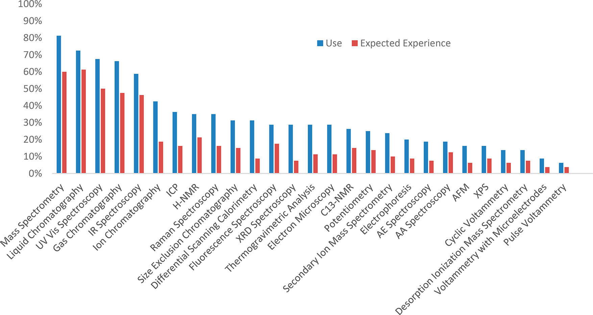

## Course Design
My goals for the design of this course were to emphasize:
- The entire sequence of steps of the analytical process, from defining problems, selecting methods, preparing samples, analyzing samples, interpreting data, and reporting results.
- The role of chemical measurements in solving problems, both in research and in society.
- Mass spectrometry, liquid chromatography, gas chromatography, aborbance spectroscopy, and infrared spectroscopy, which are the most-used instrumental techqniques in industry and techniques that empoyers most-expect candiates to have experience.
  
These goals were greatly influenced by two specific resources. First, the Committee on Professional Training of the American Chemical Society published an Analytical Chemistry Supplement ([link](/https://www.acs.org/content/dam/acsorg/about/governance/committees/training/acsapproved/degreeprogram/analytical-chemistry-supplement.pdf)), which highlights best practices for instruction in analytical chemistry. This report includes the following statement (reproduced verbatim):  
> Classroom and laboratory experiences in analytical chemistry at the undergraduate level should present an integrated view of methods and instrumental techniques, including their theoretical basis, for solving a variety of real chemical problems. Students should receive a coherent treatment of the various steps of the analytical process, including: problem definition, selection of analytical method, sampling and sample preparation, validation of analytical method, data collection and interpretation, and reporting. The problem-oriented role of chemical analysis should be emphasized throughout the student’s experience. Such experiences provide an excellent introduction to the analytical process while engaging students in relevant societal problems requiring modern chemical analysis.

Second, *J. Chem. Edu.* recently published an article titled "Survey of Instrumentation Use in Industry: What Does Industry Want New Chemists to Know?" ([link](https://doi.org/10.1021/acs.jchemed.3c00990)). The article reports results from a survey of employers spanning the chemical industry (regulatory/analytical, pharmaceutical, chemical/materials, and semiconductor) and soughts to answer the following reserach questions (reproduced verbatim):
> 1.	What types of instrumentation are most commonly used by industry chemists?
> 2.	What specific instruments do industry employers expect newly hired chemists with a bachelor’s degree to have experience with?
> 3.	How does instrumentation use and expected experience in chemical industry vary across industrial contexts?
> 4.	How do industry employers rank the importance of skills and undergraduate coursework for newly hired chemists?

A key finding of this study was that the top five instruments for both use and expected experience are mass spectrometry, liquid chromatography, UV−Vis spectroscopy, gas chromatography, and infrared spectroscopy (see figure below). The most-valued skills for succeeding the chemical industry were communicaiton, problem solving, teamwork/collaboration, and critical thinking.  

**Figure 1.** Percentage of chemical industry companies (N = 80) indicating instrument use (shown in blue) and expected experience (shown in red) when hiring new chemists. The top five instruments for both use and expected experience included Mass Spectrometry (MS), Liquid Chromatography (LC), UV–Vis Spectroscopy, Gas Chromatography (GC), and Infrared (IR) Spectroscopy. Figure and caption reproduced from *J. Chem. Ed.* **2024**, *101*, 1883–1890 ([link](https://doi.org/10.1021/acs.jchemed.3c00990)).
