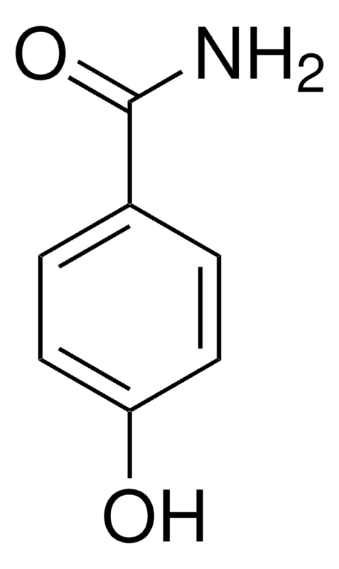
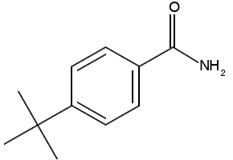
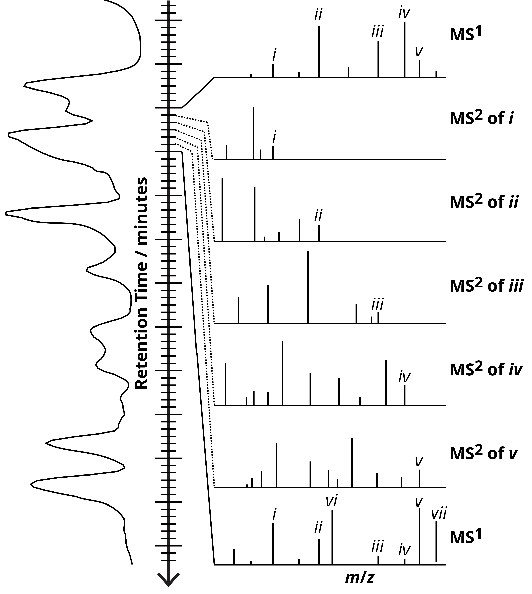
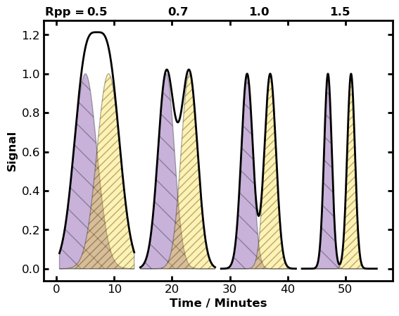
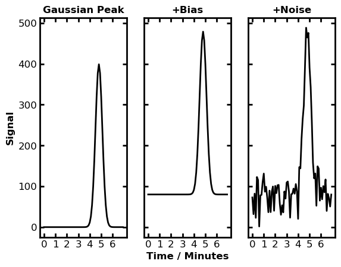

# Liquid Chromatography–Mass Spectrometry
Prof. Matthew Bush, University of Washington

## Learning Objectives
*At the conclusion of in-class and outside learning, participants will be able to:*

1. Explain why reversed-phase LC is appropriate for analytes that cannot be analyzed by GC, and predict the relative elution order of compounds from a C18 column based on their structures and polarity.
2. Explain why ESI is the natural ionization choice for LC-MS, specifically how it bridges a liquid-flow technique to a high-vacuum mass spectrometer and why other ionization methods are incompatible.
3. Select and justify the appropriate LC-MS instrument configuration (LC-QqQ vs. LC-QTOF) and acquisition mode (MRM vs. DDA) for a given analytical scenario, distinguishing targeted quantitative applications from discovery/qualitative ones.
4. Describe data-dependent acquisition (DDA) and explain how it enables collection of both MS¹ and MS² spectra during a single LC run without prior knowledge of sample composition.
5. Explain how peak-to-peak resolution, bias, and noise affect quantitative accuracy in LC-MS, and describe how MRM and isotope-labeled internal standards mitigate key sources of error including ion suppression.
6. Compare LC-MS and GC-MS with respect to analyte scope, ionization, interface design, and the type of spectral resources available for compound identification.

---

## Section 1: Why LC-MS?

We recently introduced [GC-MS](./gc-ms.md) as a powerful combination of separation and identification. But GC imposes strict requirements: analytes must be sufficiently volatile to exist as a vapor at GC operating temperatures, and they must be thermally stable throughout the experiment. Many analytes of practical interest fail one or both criteria.

Consider pharmaceuticals, which are typically polar, ionizable compounds with limited volatility. Or lipids and surfactants, which have molecular weights well above the practical GC range. Or peptides and proteins, which decompose long before they vaporize. These compound classes are inaccessible to GC but are among the most important targets in environmental monitoring, food safety, clinical diagnostics, and industrial quality control.

Liquid chromatography separates analytes in solution, carried by a liquid mobile phase through a column packed with a solid stationary phase. Because the analyte never needs to be vaporized, the volatility and thermal stability constraints of GC do not apply. The tradeoff is that the mobile phase — a flowing liquid — creates a fundamentally different coupling challenge with the mass spectrometer, which requires a high-vacuum environment. How that challenge is solved is the central engineering story of LC-MS.

---

## Section 2: Reversed-Phase Liquid Chromatography

The *retention factor* in liquid chromatography is the ratio of the time an analyte spends partitioned in the stationary phase to the time it spends in the liquid mobile phase. Because the analyte remains dissolved in solution throughout the experiment, it must simply be stable as a solute — a far less restrictive requirement than GC.

### Reversed-Phase Retention

Reversed-phase LC (RPLC) is the most widely used mode of liquid chromatography for molecular applications. It uses a **nonpolar stationary phase** and a **polar mobile phase**. The most common stationary phase is a silica support chemically modified with octadecyl (C18) chains — long, nonpolar hydrocarbon tails that extend from the surface and create a hydrophobic environment. The mobile phase is typically a mixture of water and an organic modifier such as acetonitrile or methanol, with the organic fraction increased over the course of the run (gradient elution) to progressively elute more hydrophobic analytes.

Retention in RPLC is governed by hydrophobic interactions. A nonpolar analyte prefers to partition into the nonpolar C18 stationary phase rather than remain in the aqueous mobile phase — exactly the same thermodynamic driving force that causes oil and water to separate. Polar analytes, which are stabilized by hydrogen bonding and dipole interactions with water, spend more time in the mobile phase and elute early. Nonpolar analytes interact strongly with the C18 chains and elute late.

**Key factors affecting retention in RPLC:**
- **Polarity**: More polar compounds elute earlier; more nonpolar compounds elute later.
- **Functional groups**: Hydroxyl, amine, and carboxylic acid groups increase polarity and decrease retention. Long alkyl chains and aromatic rings increase hydrophobicity and increase retention.
- **Mobile phase composition**: Increasing the organic modifier (e.g., more acetonitrile) decreases the polarity of the mobile phase and reduces retention times. Gradient elution exploits this systematically to separate complex mixtures.

### Reflection Question

A chemist is analyzing a mixture containing two pharmaceutical compounds using reversed-phase HPLC with a C18 column and a mobile phase of 30% acetonitrile / 70% water (v/v). Which compound — 4-hydroxybenzamide or 4-butylbenzamide — would you expect to elute first? Explain your reasoning based on the structures below and the principles of reversed-phase chromatography.

**Figure 1.** The chemical structure of 4-hydroxybenzamide (MW = 137.14 Da). The hydroxyl group at the para position is a hydrogen bond donor and acceptor that increases polarity.

**Figure 2.** The chemical structure of 4-butylbenzamide (MW = 177.24 Da). The four-carbon butyl group at the para position is hydrophobic and increases retention on a C18 column.

---

## Section 3: The LC-MS Interface

Connecting a liquid chromatograph to a mass spectrometer is not straightforward. The mass spectrometer requires a vacuum of approximately $10^{-3}$ to $10^{-10} inside the mass analyzer (depending on the analyzer type), but most LC systems delivers a continuous flow of 0.1–1 mL/min of liquid solvent that once vaporized, would produce a vastly greater gas load than any vacuum pump can handle. Furthermore, most analytes of interest in LC-MS are polar, ionizable compounds that are difficult or impossible to ionize with EI (which requires vapor-phase analytes) or MALDI (which requires solid co-crystallization with a matrix).

**Electrospray ionization (ESI) solves both problems simultaneously.** ESI operates at *atmospheric pressure*, so ions are formed before they enter the vacuum system. Solvent evaporation occurs in the warm atmospheric-pressure source region, driven by heat and a curtain of drying gas, and only the desolvated gas-phase ions are drawn through a series of differentially pumped regions into the high-vacuum analyzer. The solvent load that would overwhelm the vacuum system is simply evaporated and pumped away at atmospheric and rough-vacuum stages before it ever reaches the analyzer. This is why ESI is the nearly universal ionization method for LC-MS — not simply because it is soft, but because it is the only common ionization method that operates from a flowing liquid at atmospheric pressure.

### Recall: Electrospray Ionization

**Figure 3.** Electrospray ionization in positive ion mode. The capillary is held at 1–5 kV relative to the instrument inlet. Charge accumulation at the tip deforms the liquid meniscus into a Taylor cone, ejecting highly charged droplets. Cycles of solvent evaporation and Coulombic fission ultimately release individual gas-phase ions. [Figure source](https://en.wikipedia.org/wiki/Electrospray_ionization).

ESI produces even-electron ions: $[M+H]^+$ or $[M+nH]^{n+}$ in positive mode, and $[M-H]^-$ or $[M-nH]^{n-}$ in negative mode. Small molecules (MW < ~1,000 Da) typically produce singly charged ions; larger analytes such as polymers and proteins commonly produce multiply charged ions whose $m$/$z$ values fall within the range of standard mass analyzers.

---

## Section 4: Targeted vs. Discovery LC-MS

The combination of LC separation and MS detection is powerful, but how the mass spectrometer is *operated* depends fundamentally on what question you are trying to answer. Two distinct analytical paradigms have emerged, each matched to a specific instrument architecture and acquisition strategy.

### 4.1 Targeted (Quantitative) LC-MS with a Triple Quadrupole

**The question being answered:** *How much of these specific compounds is present?*

When the target analytes are known in advance — a set of pesticides in drinking water, a panel of pharmaceutical residues in an environmental sample, or a list of industrial contaminants in a process stream — targeted LC-MS is the method of choice. Because you already know what you are looking for, you can optimize the method entirely around detecting those compounds with maximum sensitivity and selectivity.

The instrument platform for targeted LC-MS is the **triple quadrupole (QqQ)**, already discussed in the MS lecture. In the LC-MS context, the QqQ is operated in **multiple reaction monitoring (MRM)** mode: Q1 is fixed to transmit a specific precursor ion, q2 fragments it by CID, and Q3 is fixed to transmit a specific product ion. Detection requires that a signal arrive with the correct LC retention time, the correct precursor $m$/$z$, and the correct product $m$/$z$ — three independent criteria that must all be satisfied simultaneously. This makes MRM extraordinarily selective even in complex matrices.

The sensitivity advantage of MRM over full-scan methods is substantial. Because the instrument dwells on a single transition rather than scanning across a wide $m$/$z$ range, the duty cycle for the target ion is near 100%, and detection limits can be 100–1,000× lower than full-scan acquisition. For a targeted environmental method quantifying trace pesticides at regulatory detection limits, MRM on a QqQ is typically the only approach that achieves sufficient sensitivity.

The tradeoff is that MRM yields no information about unanticipated compounds. If a new contaminant appears in your sample that you did not include in your transition list, the instrument will not detect it.

### 4.2 Discovery (Qualitative) LC-MS with a Quadrupole-TOF

**The question being answered:** *What compounds are present in this sample?*

Discovery LC-MS foregoes sensitivity optimization for specific targets in exchange for comprehensive, unbiased coverage of whatever is in the sample. This is appropriate for metabolite profiling, environmental surveys of unknown contaminants, impurity identification in pharmaceutical synthesis, and any application where the sample composition is not fully known in advance.

The instrument platform for discovery LC-MS is typically a **quadrupole-time-of-flight (QTOF)** or a similar high-resolution instrument (e.g., Orbitrap). The TOF provides high mass accuracy (low-ppm errors) and high resolving power, enabling determination of elemental compositions from exact masses — something a unit-resolution QqQ cannot do. Because the TOF detects all ions simultaneously in every acquisition cycle, full-spectrum data are collected at every time point without the sensitivity penalty of scanning.

Discovery LC-MS experiments are almost always run in **data-dependent acquisition (DDA)** mode.

### 4.3 Data-Dependent Acquisition (DDA)

In DDA, the mass spectrometer automatically alternates between two types of acquisitions:

- **MS¹ survey scan:** A full-spectrum acquisition of all ions eluting from the LC at that moment. This provides the $m$/$z$ values and relative intensities of precursor ions.
- **MS² fragmentation scans:** The instrument selects the most intense precursor ions from the most recent MS¹ scan, fragments each one by CID, and acquires a product ion spectrum. Typically 5–20 precursors are selected per MS¹ cycle; each selection and fragmentation event takes a fraction of a second.

The cycle then repeats. Because LC peaks are typically 10–60 seconds wide in HPLC, many MS¹/MS² cycles are collected across each peak, yielding both accurate mass data and fragmentation data for the analytes eluting at that time.

**Figure 4.** Data-dependent acquisition during an LC-MS² experiment. The mass spectrometer alternates between MS¹ survey spectra (top and bottom) and MS² fragmentation spectra for the five most-intense precursor ions identified in the preceding MS¹ scan (middle). Each spectrum is typically acquired in under one second, so thousands of spectra accumulate during a single LC run.

A critical difference from GC-MS library searching: because ESI is a soft ionization technique, the MS¹ spectrum contains little or no structural information — typically just the $[M+H]^+$ ion. Compound identification in discovery LC-MS therefore relies on MS² fragmentation spectra combined with accurate mass, not on EI-style spectral library matching against unit-resolution fragment patterns. Databases such as MassBank, HMDB, and vendor-specific libraries exist for LC-MS² spectra, but coverage is far less comprehensive than the NIST EI library, and confident identification of unknowns often requires additional evidence.

---

## Section 5: Quantitative Accuracy in LC-MS

Getting good quantitative data from an LC-MS experiment requires managing several sources of error that interact in ways that are specific to the technique. Three of these — chromatographic resolution, baseline contributions from bias and noise, and ion suppression — deserve careful attention.

### 5.1 Peak-to-Peak Resolution and Its Effect on Quantitation

As introduced in the chromatography lecture, **peak-to-peak resolution ($R_{pp}$)** describes how well two adjacent chromatographic peaks are separated:

$$R_{pp} = \frac{t_{r,2} - t_{r,1}}{0.5(w_1 + w_2)}$$

This matters directly for quantitative accuracy. When $R_{pp}$ is low, the signal from one analyte overlaps substantially with the signal from another, making it impossible to accurately integrate either peak individually. Figure 5 illustrates this effect.

**Figure 5.** Pairs of chromatographic peaks at different $R_{pp}$ values. The observable signal (black trace) is the sum of both components. At $R_{pp} \approx 0.7$, individual peak *heights* can be estimated with reasonable accuracy, but peak *areas* include substantial contributions from the neighboring peak. At $R_{pp} \geq 1.5$, both heights and areas can be measured accurately.

**Peak height vs. peak area:** Both are used for quantitation. Peak areas integrate all of the analyte's signal and are generally more accurate when peaks are well-resolved. Peak heights are less affected by interference from partially overlapping neighboring peaks, making them preferable when $R_{pp}$ is modest. In MRM, the high selectivity of the precursor/product ion transition often eliminates co-eluting interferences that would affect less selective detectors, restoring the advantage of peak area even at moderate chromatographic resolution.

### 5.2 Bias and Noise

Every measured chromatographic signal contains contributions beyond the analyte itself.

**Bias** (systematic offset) shifts the entire baseline upward (or downward). Sources include column bleed, solvent impurities, reagent backgrounds, and electronic offsets. A bias raises the apparent peak height and area, introducing a systematic positive error unless it is subtracted — typically by measuring a blank sample and subtracting the baseline signal.

**Noise** (random fluctuation) adds variability to every data point. Noise limits the detection limit of the method: a signal must be distinguishable from the noise to be reliably quantified. The signal-to-noise ratio (S/N) is the critical figure of merit, and methods requiring low detection limits (e.g., trace environmental monitoring) must minimize all noise sources.

**Figure 6.** Left: an ideal Gaussian chromatographic peak. Center: the same peak with a positive bias (baseline offset). Right: the same peak with both bias and noise. In practice, both contributions are always present and must be accounted for in quantitation.

### 5.3 Ion Suppression — An LC-MS-Specific Challenge

Ion suppression is one of the most important and practically consequential phenomena unique to LC-ESI-MS. It has no direct analogue in GC-MS.

In electrospray ionization, the efficiency with which an analyte is converted from solution into a gas-phase ion depends on the composition of the droplet from which it evaporates. If co-eluting matrix components — salts, phospholipids, detergents, other small molecules — are also present in the droplet, they compete for charge during evaporation and can dramatically reduce the ionization efficiency of the target analyte. The result is that the same concentration of analyte produces less signal when the matrix is present than when measured in a clean solvent. Ion suppression can reduce signals by 10–90% in complex matrices such as plasma, soil extracts, or food homogenates.

**Consequences for quantitation:** A calibration curve prepared in clean solvent will systematically overestimate analyte concentrations when used to quantify signals measured in a complex matrix, because the matrix-suppressed signal appears lower than expected. This can produce large, difficult-to-detect errors.

**The solution — isotope-labeled internal standards:** The most reliable way to correct for ion suppression is to add a **stable-isotope-labeled (SIL) internal standard** — a version of the target analyte in which several atoms are replaced with heavy isotopes (²H, ¹³C, or ¹⁵N) — at known concentration directly to the sample before any processing. Because the labeled and unlabeled forms are chemically identical, they co-elute from the LC column, enter the same ESI droplets, and experience the same degree of ion suppression. Their $m$/$z$ values differ by the mass of the isotope labels (typically 3–10 Da), so they are easily distinguished by the mass spectrometer. By computing the ratio of analyte signal to internal standard signal, ion suppression effects cancel out — both signals are suppressed by the same factor. This is the LC-MS extension of the isotope dilution strategy introduced in the GC-MS lecture, and it is applied even more broadly in LC-MS because ion suppression is ubiquitous.

---

## Section 6: GC-MS vs. LC-MS — An Integrated Comparison

Having now studied both hyphenated techniques, it is worth comparing them systematically. Neither is universally superior; the choice depends on the analyte and the analytical question.

| Property | GC-MS | LC-MS |
|---|---|---|
| Analyte requirements | Volatile, thermally stable, MW < ~600 Da | Soluble; wide polarity and MW range |
| Typical analytes | Hydrocarbons, solvents, pesticides, flavor/fragrance | Pharmaceuticals, lipids, polar pesticides, polymers, biomolecules |
| Ionization method | Electron ionization (EI) | Electrospray ionization (ESI) |
| Ion types | Radical cations (M⁺·), fragment ions | Even-electron [M+nH]^n+, [M-nH]^n-; multiply charged ions common |
| Interface challenge | Capillary flow rates directly vacuum-compatible | Flowing liquid requires atmospheric-pressure ionization and differential pumping |
| Spectral libraries | Extensive (NIST: >350,000 EI spectra); reliable for unknowns | More limited; MS² libraries exist but coverage is lower |
| Structural information | Rich fragment spectra from EI alone | Requires MS/MS (soft ionization yields little fragmentation without CID) |
| Quantitation strategy | SIM, isotope dilution | MRM, isotope-labeled internal standards (especially important due to ion suppression) |
| Key limitation | Analyte scope (volatility, thermal stability) | Ion suppression; less comprehensive spectral libraries for unknowns |

---

## Acknowledgements

These notes were revised for clarity and accessibility with assistance from Claude Sonnet 4.6.