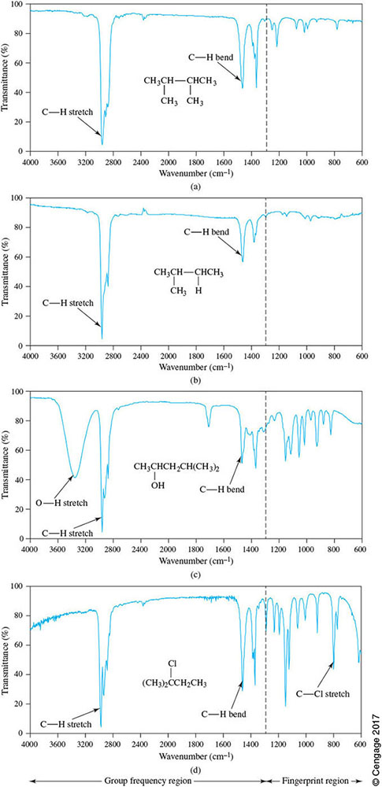
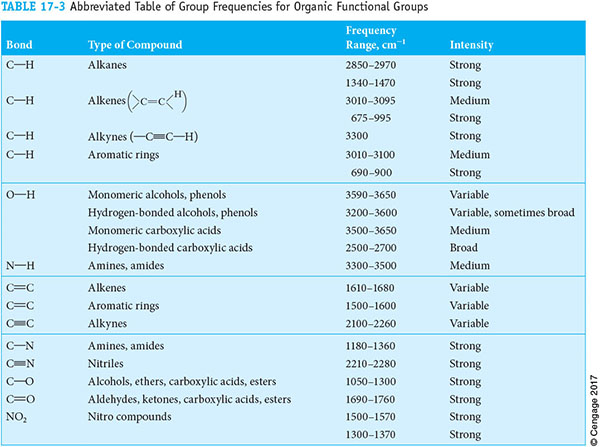
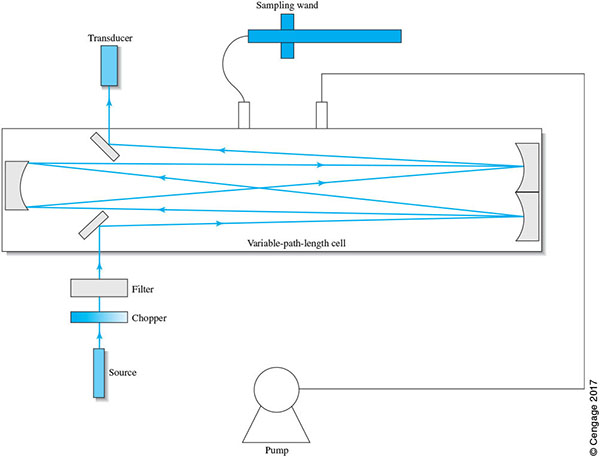
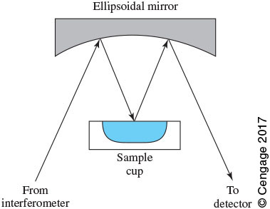
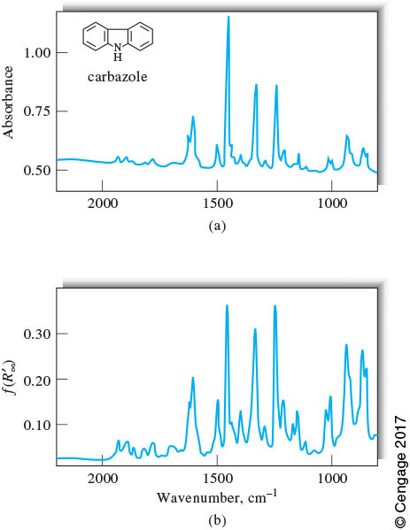
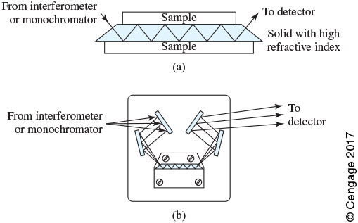
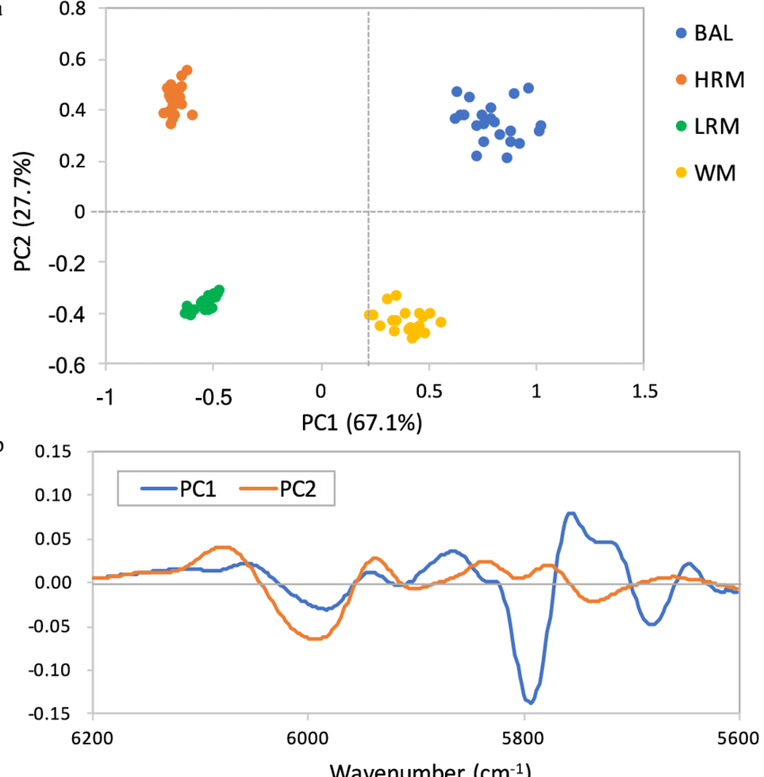

# Infrared Spectroscopy: Applications

## Learning Objectives
*At the conclusion of in-class and outside learning, participants will be able to:*
- Compare and contrast qualitative and quantitative applications of IR spectroscopy.
- Describe the use of spectral libraries for qualitative applications.
- Compare the information content and utility of mid-IR and near-IR measurements.
- Compare multichannel IR measurements with IR measurements using photometers.
- Describe the mechanism in reflectance IR, ATR, and CRDS.
- Compare and contrast CLS, PLS, and PLA analysis.

## Suggested Reading
- [Mid-IR Absorption Spectrometry](https://chem.libretexts.org/Bookshelves/Analytical_Chemistry/Instrumental_Analysis_(LibreTexts)/17%3A_Applications_of_Infrared_Spectrometry/17.01%3A_Mid-Infrared_Absorption_Spectometry)
- [Mid-IR Reflection Spectrometry](https://chem.libretexts.org/Bookshelves/Analytical_Chemistry/Instrumental_Analysis_(LibreTexts)/17%3A_Applications_of_Infrared_Spectrometry/17.02%3A_Mid-Infrared_Reflection_Spectrometry)
- [Near-IR Spectroscopy](https://chem.libretexts.org/Bookshelves/Analytical_Chemistry/Instrumental_Analysis_(LibreTexts)/17%3A_Applications_of_Infrared_Spectrometry/17.03%3A_Near_Far_IR)

## Suggested Problems
- [Suggested Problems](https://github.com/mfbush/instrumental-analysis/blob/main/suggested-problems/sp-ir-applications.md)
- [Solutions to Suggested Problems](https://github.com/mfbush/instrumental-analysis/blob/main/suggested-problems/sp-ir-applications-solutions.md)

---

## Qualitative Analysis

Identifying molecules based on their infrared spectra is a **qualitative application** of IR spectroscopy, contrasting with **quantitative applications** that measure the concentration or amount of analytes.

### Spectral Features for Identification

Infrared spectra contain two key regions used for molecular identification:

**Group Frequency Region** (3600–1250 cm⁻¹): Contains absorptions characteristic of specific functional groups (O-H, N-H, C=O, C-H stretches, etc.). These features are relatively consistent across different molecules containing the same functional group.

**Fingerprint Region** (1200–600 cm⁻¹): Contains complex patterns of absorptions from coupled vibrations. These patterns are unique to each molecule and provide definitive identification.

**Figure 1.** Representative mid-IR spectra showing the group frequency and fingerprint regions. Reproduced from Figure 17-5 in Skoog *Principles of Instrumental Analysis*.

**Table 1.** Abbreviated Table of Group Frequencies for Organic Functional Groups.

### Spectral Libraries

In modern analytical laboratories, most unknown spectra are assigned through **comparison with spectral libraries** containing reference spectra obtained for pure standards under controlled conditions. This approach is faster and more reliable than *de novo* interpretation using group frequency tables.

**Available libraries include:**
- Public databases: NIST Chemistry WebBook
- Commercial collections: Sigma-Aldrich Library (11,270+ FT-IR spectra)
- Custom application-specific libraries for proprietary compounds

#### Scoring Spectral Matches

Modern library searching uses algorithms to rank potential matches:

**Hit Quality Index (HQI):** A numerical score (typically 0-1) quantifying the similarity between an unknown and library spectrum. Common approaches include Euclidean distance, mean absolute deviation, or correlation coefficients. Higher HQI values indicate better matches.

**p-value Statistical Testing:** While HQI provides a similarity score, it doesn't answer whether the match is statistically meaningful. Modern searching uses p-value estimation:

1. Generate a **null distribution** by comparing the target spectrum with random non-matches
2. Calculate the **p-value** as the proportion of null distribution scores ≥ observed HQI
3. Low p-values (< 0.05) indicate statistically significant matches

**Example - Cellulose Identification:**

**Table 2.** Sample data testing microcrystalline cellulose identification ($\alpha = 0.05$). Reproduced from *Analytical methods for field-based material identification and verification*. [Link](https://documents.thermofisher.com/TFS-Assets/CAD/Application-Notes/TS-Pharma-pvalue-HQI.pdf)

| Sample | p-value | HQI |
| --- | --- | --- |
| Microcrystalline cellulose | 0.338 | 0.9998 |
| Hydroxyethyl Cellulose | 0.00000754 | 0.9970 |
| Methyl Cellulose | 0.00000185 | 0.9766 |
| Hydroxypropyl Cellulose | 0.0000000323 | 0.9796 |

All cellulose variants show high HQI values (> 0.97) due to similar chemical structures, but only the true match has p > 0.05. **This demonstrates that HQI alone is insufficient for confident identification—statistical significance testing is essential.**

The Connes advantage of FT-IR (internal He-Ne laser reference providing high wavelength accuracy) enables reliable spectral library matching across different instruments and times by ensuring precise, reproducible wavenumber values.

---

## Quantitative Analysis

### Gas Analysis Using Photometers

For dedicated gas analysis applications, **IR photometers** provide simple, robust solutions. Unlike FT-IR spectrometers that measure full spectra, photometers measure absorbance at a single wavelength optimized for the target analyte.

**Multipass cells** increase sensitivity by extending effective path length. **Herriott cells** consist of two spherical mirrors that create systematic reflection patterns. A 0.4 m cell can achieve 10.4 m (28 passes) or 31.2 m (80 passes) effective path length.

**Figure 2.** Portable IR photometer with multipass cell. Path length adjustable via number of reflections. Reproduced from Figure 16-13 in Skoog *Principles of Instrumental Analysis*.

**Figure 3.** Herriott cell multipass optical cavity. Image from Thorlabs.

According to Beer's Law ($A = \varepsilon bc$), absorbance is directly proportional to path length. Therefore, **detection limit is inversely proportional to path length**—tripling path length improves detection limit by a factor of 3.

**Photometer vs. Multichannel FT-IR:**

**Photometer advantages:** Simple, portable, rugged, low cost, real-time readings, optimized for specific analyte

**FT-IR advantages:** Full spectral information, simultaneous multi-gas analysis, spectral confirmation of identity, Fellgett advantage provides better signal-to-noise through averaging

### Cavity Ring-Down Spectroscopy (CRDS)

CRDS achieves exceptional sensitivity through a fundamentally different measurement approach. It measures the **decay time** ($\tau$) of light trapped in a high-finesse optical cavity formed by two highly reflective mirrors (R > 99.99%).

**Operating principle:**
1. Laser pulse injected into cavity
2. Light reflects back and forth thousands of times
3. Light gradually leaks out through mirrors, creating exponential decay
4. Detector measures ring-down time constant ($\tau$)
5. When absorbing sample is introduced, decay accelerates (shorter $\tau$)

The ring-down time relates to cavity losses:

$$\frac{1}{\tau} = \frac{c}{L}(\alpha_{\text{mirror}} + \alpha_{\text{sample}})$$

where $c$ is speed of light, $L$ is cavity length, and $\alpha$ represents absorption coefficients.

**Figure 4.** Ring-down signals with (red) and without (black) absorbing medium. Faster decay indicates absorption. From University of Bremen.

**High sensitivity mechanisms:**

1. **Long effective path length:** Mirror reflectivities > 99.99% trap light for thousands of reflections, creating effective path lengths of kilometers in compact devices
2. **Intrinsic noise immunity:** Measuring absolute time constants (not intensity ratios) eliminates sensitivity to laser power fluctuations and detector noise

These advantages enable detection limits orders of magnitude better than conventional absorption spectroscopy, making CRDS ideal for trace gas analysis.

---

## Mid-IR Reflection Spectroscopy

Reflection techniques extend IR spectroscopy to samples difficult to prepare for conventional transmission measurements.

### Diffuse Reflectance

Widely used for powder analysis with minimal preparation. IR radiation penetrates the powder, scatters from particle surfaces, and emerges as diffuse reflectance. Absorbed wavelengths show reduced reflectance.

The **Kubelka-Munk function** converts reflectance ($R$) to a quantity proportional to concentration:

$$f(R) = \frac{(1-R)^2}{2R} = \frac{k}{s}$$

where $k$ is absorption coefficient (proportional to concentration) and $s$ is scattering coefficient.

**Figure 5.** Diffuse reflectance attachment. Mirrors collect scattered radiation for detection. Reproduced from Figure 17-11 in Skoog *Principles of Instrumental Analysis*.

**Figure 6.** Comparison of (a) transmission and (b) diffuse reflectance spectra of carbazole showing similar peak patterns. Reproduced from Figure 17-12 in Skoog *Principles of Instrumental Analysis*.

### Attenuated Total Reflection (ATR)

ATR enables the analysis of samples difficult or impossible to measure by transmission (thick films, opaque materials, strongly absorbing samples, aqueous solutions).

**Mechanism - The Evanescent Wave:**

1. IR light traveling through high-refractive-index crystal ($n_1$, e.g., diamond, germanium, ZnSe) hits sample interface ($n_2$) at angle exceeding the critical angle
2. **Total internal reflection** occurs, creating an **evanescent wave**—an electromagnetic field extending beyond the crystal surface into the sample
3. The evanescent wave penetrates only a few micrometers into the sample
4. Sample absorbs energy from the evanescent wave at characteristic frequencies
5. Reduced reflection at absorbed wavelengths produces the IR spectrum

**Penetration depth:**

$$d_p = \frac{\lambda}{2\pi n_1 \sqrt{\sin^2\theta - (n_2/n_1)^2}}$$

Typical penetration: 0.5-5 μm (wavelength-dependent)

**Figure 7.** ATR apparatus. Common crystals: diamond ($n \approx 2.4$), germanium ($n \approx 4.0$), zinc selenide ($n \approx 2.4$). Reproduced from Figure 17-13 in Skoog *Principles of Instrumental Analysis*.

**Why ATR works for difficult samples:** The shallow penetration depth (few micrometers) provides a very short effective path length, preventing detector saturation even for thick or highly absorbing materials.

**ATR vs. Transmission spectra:** Peak positions are identical (same molecular vibrations), but relative intensities may differ because evanescent wave penetration depth is wavelength-dependent—longer wavelengths penetrate deeper, experiencing different effective path lengths.

---

## Near-Infrared Spectroscopy

The near-IR region (12,800-4,000 cm⁻¹ or 0.8-2.5 μm) contains **overtones** ($\Delta v = 2, 3, ...$) and **combination bands** rather than fundamental transitions. These have much weaker molar absorptivities (10-100× less than fundamentals).

### Advantages for Quantitative Analysis

Despite weaker absorption, near-IR offers practical benefits for routine quantitative analysis:

**1. Direct analysis of concentrated samples:** Weaker absorption allows measurement of intact tablets, thick samples, and concentrated solutions without dilution, grinding, or film preparation.

**2. Superior signal-to-noise ratio:** Near-IR sources (tungsten-halogen lamps) are brighter and detectors (Si, InGaAs photodiodes) have better performance and lower noise than mid-IR detectors (DTGS, MCT), operating at room temperature.

**3. Fiber optic compatibility:** Near-IR wavelengths transmit efficiently through silica optical fibers, enabling remote sampling, process monitoring, and in-line quality control. Mid-IR fiber optics are limited to expensive, fragile specialty materials.

**4. Minimal atmospheric interference:** Reduced H₂O and CO₂ absorption eliminates need for nitrogen purging.

**Applications:** Industrial quality control (pharmaceutical API content, agricultural grain analysis, food composition), process monitoring (real-time reaction monitoring, crystallization control), and medical diagnostics.

### Mid-IR vs. Near-IR Comparison

| Feature | Mid-IR | Near-IR |
|---------|--------|---------|
| Transitions | Fundamentals | Overtones, combinations |
| Molar absorptivity | High | Low (10-100× weaker) |
| Sample preparation | Often required | Minimal |
| Spectral interpretation | Direct (group frequencies) | Complex (overlapping) |
| Qualitative analysis | Excellent | Difficult |
| Quantitative analysis | Good | Excellent (with calibration) |
| Fiber optics | Limited | Excellent |
| Industrial applications | Lab-based identification | Process/field monitoring |

**Key insight:** Mid-IR excels at qualitative identification with interpretable fundamental transitions and well-defined group frequencies. Near-IR excels at quantitative analysis with minimal sample preparation, though overlapping bands require chemometric methods.

---

## Chemometrics and Multivariate Calibration

Near-IR spectra, with overlapping overtone and combination bands, require **chemometric** (mathematical/statistical) methods to extract quantitative information.

### Classical Least Squares (CLS)

CLS extends Beer's Law to multiple components and wavelengths:

$$\mathbf{A} = \mathbf{C} \cdot \mathbf{E}$$

where **A** is absorbance, **C** is concentration, and **E** is pure component spectra.

**Requirements:** Pure component spectra must be known, all absorbing species identified, Beer's Law must hold (no scattering or interactions)

**Best for:** Simple, well-characterized liquid or gas mixtures

**Limitations:** Cannot handle unknown interferents, sensitive to baseline shifts, requires pure standards

### Partial Least Squares (PLS)

PLS builds empirical calibration models using **latent variables** that maximize covariance between spectra and concentrations—no pure component spectra needed.

**Advantages over CLS:**
- Uses calibration samples (20-100+ samples with known concentrations from reference method)
- Handles matrix effects, baseline shifts, light scattering
- Tolerates unknown components if they don't vary with analyte
- Reduces hundreds of wavelengths to few latent variables (noise reduction)

**Calibration workflow:**
1. Prepare calibration set spanning concentration range
2. Collect spectra and preprocess (baseline correction, normalization)
3. Build PLS model, optimizing number of latent variables via cross-validation
4. Validate on independent test set
5. Apply to unknown samples

**Risk:** Overfitting with too many latent variables reduces prediction accuracy for new samples

### Principal Component Analysis (PCA)

PCA is an unsupervised dimensionality reduction technique transforming high-dimensional spectral data into orthogonal **principal components** (PCs) ordered by variance explained.

**Applications:**
- Exploratory data analysis and visualization (score plots)
- Quality control monitoring
- Outlier detection
- Classification via PLS-DA (Partial Least Squares - Discriminant Analysis)

**Figure 8.** PCA score plot (a) showing clear separation of four Shorea wood species based on near-IR spectra (6,200-5,600 cm⁻¹ region, C-H overtones). Loading spectra (b) show which wavelengths contribute to species discrimination. Figure from DOI: [10.4308/hjb.27.3.247](http://dx.doi.org/10.4308/hjb.27.3.247).

### Chemometric Method Comparison

| Method | Purpose | Requires | Best For |
|--------|---------|----------|----------|
| **CLS** | Quantitation | Pure component spectra | Simple mixtures, known components |
| **PLS** | Quantitation | Calibration samples with known concentrations | Complex matrices, industrial near-IR |
| **PCA** | Pattern recognition | None (unsupervised) | Exploration, quality control |
| **PLS-DA** | Classification | Class membership labels | Authentication, counterfeit detection |

---

## Summary

This lecture covered diverse applications of IR spectroscopy:

**Qualitative applications** use spectral libraries with HQI and p-value statistics for reliable compound identification, enabled by FT-IR's Connes advantage (wavelength accuracy).

**Quantitative applications** range from simple photometers (portable, single-wavelength, dedicated gas analysis) to sophisticated CRDS (ultra-sensitive cavity decay measurements achieving km effective path lengths). Specialized sampling includes diffuse reflectance (powders) and ATR (thick, opaque, or strongly absorbing samples via evanescent waves).

**Mid-IR vs. Near-IR** represent complementary approaches: Mid-IR excels at identification with strong, interpretable fundamental transitions and well-defined group frequencies. Near-IR excels at quantitation with weak overtones requiring chemometrics but enabling minimal sample preparation, fiber optic coupling, and process monitoring.

**Chemometric methods** extract quantitative information from complex spectra: CLS for simple systems with known pure component spectra; PLS for complex matrices using empirical calibration; PCA for pattern recognition, quality control, and classification.

Technique selection depends on sample type (gas, liquid, solid, powder), analytical goals (qualitative vs. quantitative), required sensitivity, and measurement environment (laboratory vs. process/field).

---

## Acknowledgements

This document was revised with assistance from Claude Sonnet 4.5.