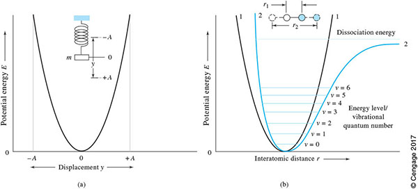
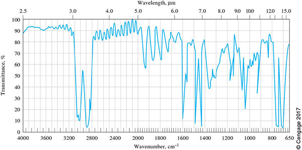
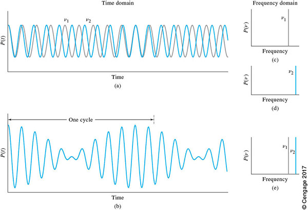
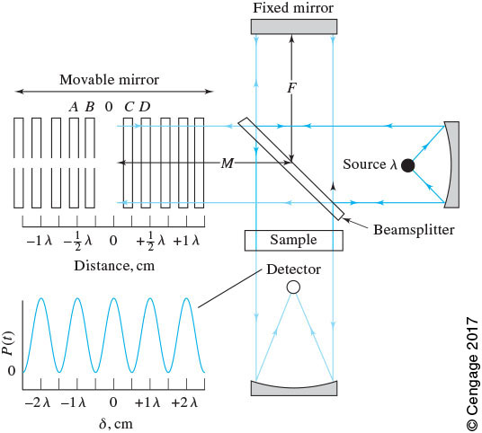
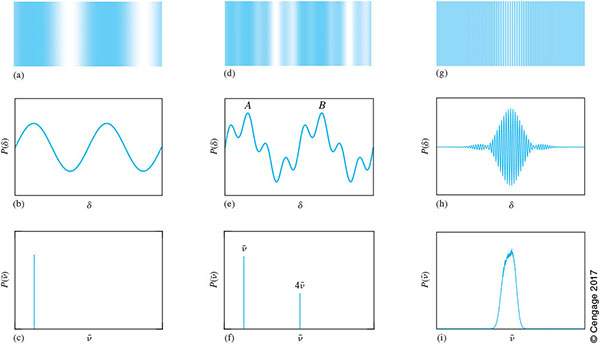
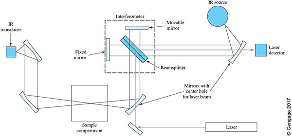

# Infrared Spectroscopy: Fundamentals, Instrumentation, and Fourier Transforms

## Learning Objectives
*At the conclusion of in-class and outside learning, participants will be able to:*
- Relate wavelength, wavenumber, and frequency in the infrared region of the spectrum.
- Describe the principle of optical interference.
- Describe the operation of a Michelson interferometer.
- Based on the frequency of light and the mirror velocity, calculate the modulated frequency in the resulting interferogram.
- List the advantages of FT-IR relative to IR using dispersive instruments.

## Suggested Reading
- [Fourier Transform Optical Spectroscopy](https://chem.libretexts.org/Bookshelves/Analytical_Chemistry/Instrumental_Analysis_(LibreTexts)/07%3A_Components_of_Optical_Instruments/7.07%3A_Types_of_Optical_Instruments)
- [Theory of Infrared Absorption Spectrometry](https://chem.libretexts.org/Bookshelves/Analytical_Chemistry/Instrumental_Analysis_(LibreTexts)/16%3A_An_Introduction_to_Infrared_Spectrometry/16.01%3A_Theory_of_Infrared_Absorption_Spectrometry)
- [Infrared Sources and Transducers](https://chem.libretexts.org/Bookshelves/Analytical_Chemistry/Instrumental_Analysis_(LibreTexts)/16%3A_An_Introduction_to_Infrared_Spectrometry/16.02%3A_Infrared_Sources_and_Transducers)
- [Infrared Instruments](https://chem.libretexts.org/Bookshelves/Analytical_Chemistry/Instrumental_Analysis_(LibreTexts)/16%3A_An_Introduction_to_Infrared_Spectrometry/16.03%3A_Infrared_Instruments)

## Suggested Problems
- [Suggested Problems](https://github.com/mfbush/instrumental-analysis/blob/main/suggested-problems/sp-ir-fundamentals.md)
- [Solutions to Suggested Problems](https://github.com/mfbush/instrumental-analysis/blob/main/suggested-problems/sp-ir-fundamentals-solutions.md)

---

## Vibrations as Oscillators

Fundamentals of molecular vibrations/vibrational spectroscopy, including selection rules and the harmonic/anharmonic oscillator, are learning objectives of CHEM 455. For our purposes, it's sufficient to understand that molecular vibrations behave as oscillators with quantized energy levels, and transitions between these levels correspond to IR absorption.

**Figure 1.** Potential-energy diagrams. (a) Harmonic oscillator (idealized). (b) Curve 1: harmonic oscillator. Curve 2: anharmonic motion (realistic). The anharmonic oscillator better represents real molecular vibrations and allows for overtone transitions. Reproduced from Figure 16-3 in Skoog *Principles of Instrumental Analysis*.

---

## Infrared Spectral Regions and Units

From *Skoog*:
> The infrared (IR) region of the spectrum encompasses radiation with wavenumbers ranging from about 12,800 to 10 $\text{cm}^{-1}$ or wavelengths ranging from 0.8 to 1000 $\mu\text{m}$. Because of similar applications and instrumentation, the IR spectrum is usually subdivided into three regions: the **near-IR**, **mid-IR**, and **far-IR**.

| Region | Wavelength, $\lambda$ ($\mu\text{m}$) | Wavenumbers, $\tilde{\nu}$ ($\text{cm}^{-1}$) | Frequency, $\nu$ (Hz) |
| :--- | --- | --- | --- |
| Near | 0.8 – 2.5 | 12800 – 4000 | $3.8 \times 10^{14} - 1.2 \times 10^{14}$ |
| Middle | 2.5 – 50 | 4000 – 200 | $1.2 \times 10^{14} - 6.0 \times 10^{12}$ |
| Far | 50 – 1000 | 200 – 10 | $6.0 \times 10^{12} - 3.0 \times 10^{11}$ |
| Most used | 2.5 – 15 | 4000 – 670 | $1.2 \times 10^{14} - 2.0 \times 10^{13}$ |

### Converting Between Wavelength, Wavenumber, and Frequency

Understanding the relationships between these quantities is essential for IR spectroscopy:

**Wavenumber and wavelength:**
$$\tilde{\nu} = \frac{1}{\lambda}$$

where $\tilde{\nu}$ is wavenumber (typically in $\text{cm}^{-1}$) and $\lambda$ is wavelength (in cm).

**Frequency and wavenumber:**
$$\nu = c \cdot \tilde{\nu}$$

where $\nu$ is frequency (Hz), $c$ is the speed of light ($3.0 \times 10^{10}$ cm/s), and $\tilde{\nu}$ is wavenumber ($\text{cm}^{-1}$).

**Frequency and wavelength:**
$$\nu = \frac{c}{\lambda}$$

These relationships allow us to express IR absorption in any of these three units, though wavenumber is the standard in IR spectroscopy.

### Representative Spectrum

To absorb IR radiation, a molecular vibration must cause a change in the dipole moment of the molecule. This requirement adds selectivity to IR analysis.
- The **near-IR** excites overtones or harmonics of fundamental vibrations.
- The **mid-IR** excites the fundamental vibrations (most commonly used).
- The **far-IR** excites low-energy vibrations and higher energy rotations.
- Assigning IR spectra, especially with regards to functional groups in organic molecules, is a learning objective for organic chemistry and CHEM 460/463.

**Figure 2.** IR absorption spectrum of a thin polystyrene film. Note the scale changes on the x-axis at 2000 $\text{cm}^{-1}$. Reproduced from Figure 16-1 in Skoog *Principles of Instrumental Analysis*.

---

## Principles of Optical Interference

Before understanding how a Michelson interferometer works, we need to understand the fundamental principle of **optical interference**.

### Constructive and Destructive Interference

When two electromagnetic waves overlap, they can interfere with each other:

- **Constructive interference** occurs when waves are **in phase** (peaks align with peaks, troughs with troughs). The amplitudes add together, creating a wave with larger amplitude.

- **Destructive interference** occurs when waves are **out of phase** (peaks align with troughs). The amplitudes cancel each other, creating a wave with smaller amplitude or no wave at all.

The degree of interference depends on the **phase difference** between the two waves, which is determined by the **optical path difference**:

$$\Delta = 2d$$

where $d$ is the difference in physical distance traveled by the two beams.

- When $\Delta = n\lambda$ (where $n = 0, 1, 2, ...$), the waves are in phase → **constructive interference**
- When $\Delta = (n + \frac{1}{2})\lambda$, the waves are out of phase → **destructive interference**

This principle of interference is what makes the Michelson interferometer work.

---

## Instrumental Approaches to Infrared Spectroscopy

Infrared spectrometers can be classified into three main categories based on how they measure the spectrum:

**1. Non-dispersive instruments (Filter Photometers)**
- Use optical filters to select specific IR wavelengths
- Single-channel detection
- Portable and simple
- Typically used for dedicated gas analyzers (CO, CO₂, HCN, etc.)
- Limited to measuring a few specific wavelengths

**2. Dispersive instruments**
- Use gratings or prisms to separate wavelengths spatially
- Can use single-channel detection (scanning monochromator) or multichannel detection (array detectors)
- Sequential wavelength measurement for single-channel systems
- Limited by the tradeoff between slit width (resolution) and light throughput (sensitivity)

**3. Fourier Transform instruments (FT-IR)**
- Use an interferometer instead of a monochromator
- All wavelengths measured simultaneously
- Dominant modern approach for laboratory IR spectroscopy
- Provides significant advantages over dispersive methods

The remainder of this lecture focuses on **FT-IR instrumentation** because it has largely replaced dispersive IR in research and analytical laboratories. Understanding how FT-IR works and why it offers superior performance is essential for modern infrared spectroscopy.

---

## Principles of Fourier Transform Optical Measurements

Unlike the dispersive and filter-based instruments described above, FT-IR instruments do not operate in the **frequency domain** where data is acquired as a function of frequency using filters or monochromators. Instead, FT-IR uses an alternative approach.

### Challenges for Measuring IR Spectra Using Dispersive Approaches
- **Low source intensity:** IR sources emit relatively weak radiation
- **Poor detector sensitivity:** IR detectors have slow response times and high noise
- **Sequential measurement:** Dispersive instruments measure one wavelength at a time, which is slow

### Solution: Perform Measurements in the Time Domain

An alternative approach is to acquire data in the **time domain**. FT-IR allows **simultaneous measurement of all wavelengths** through the use of an interferometer, typically a **Michelson interferometer**, rather than measuring each wavelength sequentially.

**How it works:**
- The interferometer produces an **interferogram** containing information about all frequencies
- The interferogram is then mathematically converted to a spectrum using a **Fourier transform**

**Advantages relative to dispersive techniques:**
1. **Significantly faster data collection** – all frequencies are analyzed simultaneously (**Fellgett or Multiplex Advantage**)
2. **Significantly more light reaches the detector** – less light is filtered away (**Jacquinot or Throughput Advantage**)
3. **Improved signal-to-noise ratio** – easier to average many replicate measurements, and signal-to-noise improves as:

$$\left(\frac{S}{N}\right)_n \approx \sqrt{n} \cdot \left(\frac{S}{N}\right)_i$$

for $n$ independent measurements

4. **Better wavelength accuracy** – internal laser reference provides precise wavelength calibration (**Connes Advantage**)

### Time Domain Signals

**Figure 3.** (a) Time-domain plot of two slightly different frequencies, $\nu_1$ and $\nu_2$, of the same amplitude. (b) Time-domain plot of the sum of the two waveforms in (a). (c) Frequency-domain plot of $\nu_1$. (d) Frequency-domain plot of $\nu_2$. (e) Frequency-domain plot of the waveform in (b). The Fourier transform converts the time-domain signal (b) into the frequency-domain spectrum (e). Reproduced from Figure 7-41 in Skoog *Principles of Instrumental Analysis*.

---

## The Michelson Interferometer

Signals like those in Figure 3 are not directly measurable in the IR region because the frequencies ($10^{12}-10^{14}$ Hz) are too high for existing transducers. To obtain time-domain signals, the high-frequency optical signal is **modulated** (converted) to a much lower, measurable frequency, without distorting the information carried in the original signal. The Michelson interferometer accomplishes this modulation.

### How the Michelson Interferometer Works

**Figure 4.** Schematic of a Michelson interferometer illuminated by a monochromatic light source. Reproduced from Figure 7-43 in Skoog *Principles of Instrumental Analysis*.

**Operating principle:**

1. **Beam splitting:** Incoming radiation from the source strikes a **beamsplitter** (typically a semi-transparent mirror) that divides the beam into two paths of approximately equal intensity.

2. **Two optical paths:**
   - One beam is reflected to a **fixed mirror** at distance $F$ from the beamsplitter
   - The other beam is transmitted to a **movable mirror** at distance $M$ from the beamsplitter

3. **Beam recombination:** Both beams return to the beamsplitter and recombine. The recombined beam travels to the detector.

4. **Interference:** The two beams have traveled different path lengths. Their optical path difference creates constructive or destructive interference depending on the position of the movable mirror.

**Key concept:** As the movable mirror moves at constant velocity, the optical path difference continuously changes, causing the interference pattern to oscillate between constructive and destructive. This creates a time-varying signal at the detector.

### Calculating the Modulated Frequency

When monochromatic light of frequency $\nu$ (or wavelength $\lambda$) enters the interferometer, and the movable mirror travels at constant velocity $v_m$, the **modulated frequency** $f_{\text{mod}}$ detected is:

$$f_{\text{mod}} = \frac{2\nu v_m}{c} = \frac{2v_m}{\lambda}$$

where:
- $f_{\text{mod}}$ is the modulated frequency at the detector (Hz)
- $\nu$ is the optical frequency of the IR radiation (Hz)
- $v_m$ is the mirror velocity (cm/s)
- $c$ is the speed of light ($3.0 \times 10^{10}$ cm/s)
- $\lambda$ is the wavelength (cm)

**Why the factor of 2?** The optical path difference changes by twice the mirror displacement because the beam makes a round trip to the moving mirror and back.

**Important implications:**
- The modulated frequency is **directly proportional** to the mirror velocity
- Faster mirror movement creates higher modulated frequencies
- Different optical frequencies produce different modulated frequencies
- This modulation converts IR frequencies ($\sim 10^{13}$ Hz) into audio frequencies ($\sim 10^2-10^3$ Hz) that can be measured by detectors

---

## Fourier Transforms and Interferograms

A **Fourier transform** is a mathematical operation that converts the interferogram (a plot of light intensity versus mirror position or time) into a spectrum (intensity versus frequency). It essentially decodes how much each frequency contributes to the original interferogram pattern.

**Figure 5.** Formation of interferograms at the output of the Michelson interferometer. (a) Interference pattern resulting from a monochromatic light source. (b) Sinusoidally varying signal (interferogram) produced at the detector as the mirror sweeps. (c) Frequency spectrum of (b) – a single peak. (d) Two-frequency source producing a more complex interferogram. (e) Frequency spectrum showing two peaks. (g) Broad emission band creating a complex interferogram. (h) The corresponding broad frequency spectrum. Reproduced from Figure 7-44 in Skoog *Principles of Instrumental Analysis*.

**Key observations:**
- A single wavelength produces a simple sinusoidal interferogram
- Multiple wavelengths create more complex interferograms
- The Fourier transform extracts the individual frequency components
- A broad-band source creates a complex interferogram that, when Fourier transformed, reveals all the frequencies present

### Resolution in FT-IR

The **resolution** of a Fourier transform spectrometer is determined by how far the movable mirror travels. Specifically, the minimum wavenumber difference $\Delta\tilde{\nu}$ between two peaks that can be distinguished is:

$$\Delta\tilde{\nu} \propto \frac{1}{\text{maximum mirror displacement}}$$

**Therefore:**
- **Longer mirror travel** → **higher resolution** (ability to distinguish closely spaced peaks)
- **Shorter mirror travel** → **lower resolution** (faster scans but less detail)

This is a fundamental trade-off in FT-IR: resolution vs. scan speed.

---

## FT-IR Instruments

**Figure 6.** Single-beam FT-IR spectrometer. The IR source radiation is split by the beamsplitter. One portion travels to the fixed mirror and back, the other to the movable mirror and back. When the beams recombine at the beamsplitter, they interfere with each other. The combined beam passes through the sample to the IR detector. A plot of detector signal versus mirror displacement is the **interferogram**, which contains information about all frequencies present. The **spectrum** (intensity versus frequency) is obtained by taking the **Fourier transform** of the interferogram. Reproduced from Figure 16-8 in Skoog *Principles of Instrumental Analysis*.

### The Three Classical Advantages of FT-IR

Understanding why FT-IR has largely replaced dispersive IR is important:

#### 1. Fellgett Advantage (Multiplex Advantage)
All wavelengths are measured **simultaneously** rather than sequentially. This means:
- Much faster data collection (full spectrum in ~1 second vs. minutes)
- For the same measurement time, better signal-to-noise ratio
- Easy to collect and average many scans to improve S/N

#### 2. Jacquinot Advantage (Throughput Advantage)
FT-IR uses **circular apertures** instead of narrow slits (required in dispersive instruments to achieve resolution). This means:
- Much more light reaches the detector (higher throughput)
- Better sensitivity
- Improved signal-to-noise ratio

#### 3. Connes Advantage
FT-IR uses an **internal He-Ne laser** as a wavelength reference for the interferometer mirror position. This means:
- Extremely high wavelength accuracy and precision
- No need for external wavelength calibration
- Highly reproducible spectra for library matching

These three advantages combine to make FT-IR the preferred method for most IR applications, even when speed is not the primary concern.

---

## Conclusions

In this lecture, we established the fundamental principles underlying modern infrared spectroscopy:

**Spectroscopic Foundations:**
- The relationships between wavelength ($\lambda$), wavenumber ($\tilde{\nu}$), and frequency ($\nu$) allow us to express IR absorption in different units, with wavenumber being the standard
- IR spectroscopy probes molecular vibrations, which behave as quantized oscillators
- Different IR regions (near, mid, far) excite different types of vibrational transitions

**Instrumentation Principles:**
- Optical interference creates the time-varying signals detected in FT-IR
- The Michelson interferometer modulates high-frequency IR radiation into measurable low-frequency signals through controlled path length differences
- The modulated frequency depends on both the IR radiation frequency and the mirror velocity: $f_{\text{mod}} = 2\nu v_m/c$
- Fourier transforms convert interferograms (time domain) into IR spectra (frequency domain)

**Why FT-IR Dominates:**
The three classical advantages—**Fellgett** (multiplex), **Jacquinot** (throughput), and **Connes** (wavelength accuracy)—explain why FT-IR has displaced dispersive IR in most laboratory applications. These advantages directly impact the quality and efficiency of both qualitative and quantitative analyses.

### Looking Ahead: Applications of Infrared Spectroscopy

The instrumental principles we've covered provide the foundation for understanding how IR spectroscopy is applied in analytical chemistry. In the next lecture, we will explore:

**How we use IR measurements:**
- Qualitative applications using spectral libraries (enabled by the Connes advantage)
- Quantitative applications leveraging the multiplex and throughput advantages
- When to choose mid-IR vs. near-IR based on information content and sampling requirements

**Different measurement modes:**
- How reflectance, attenuated total reflectance (ATR), and cavity ring-down spectroscopy (CRDS) extend IR to different sample types
- The role of multichannel detection in specialized applications
- Trade-offs between different instrumental approaches

**Advanced data analysis:**
- Multivariate calibration methods (CLS, PLS, PLA) that exploit the rich information content of IR spectra
- How these methods leverage the simultaneous measurement of all wavelengths in FT-IR

Understanding the fundamental principles of optical interference, interferometry, and Fourier transforms is essential for making informed decisions about which IR technique and data analysis approach to use for a given analytical problem. The advantages we've discussed—simultaneous measurement, high throughput, and wavelength accuracy—translate directly into practical benefits for real-world applications.

---

## Acknowledgements

This document was revised with assistance from Claude Sonnet 4.5.